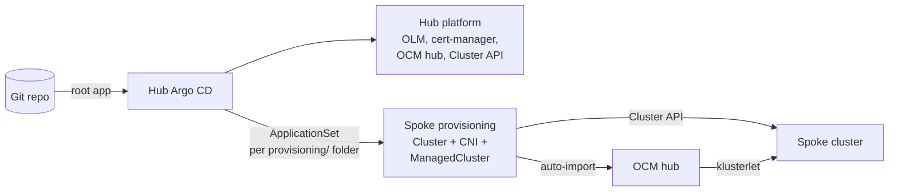

# OpenShift fleet GitOps (app-of-apps + Kustomize)

A GitOps repository for running a **fleet of Kubernetes clusters from one hub**, in the same way
OpenShift, Red Hat Advanced Cluster Management (RHACM) and OpenShift GitOps do it in production.
The hub creates clusters from Git, registers them, and hands them over to their own Argo CD.

The repository runs as a **lab on a laptop** (k3d, no domain, no Red Hat subscription), using the
open-source upstream of every product. Every pattern maps one-to-one to real OpenShift + RHACM.
For a production installation, see
[docs/openshift-implementation.md](docs/openshift-implementation.md).

## How it works



1. **Bootstrap once.** `scripts/bootstrap.sh` creates the hub, installs OLM and the Argo CD
   operator, and installs a small Helm chart with a `root` Application. From then on, Git owns
   the cluster.
2. **App of apps.** `root` renders `helm/infra`, which creates the `infra` Application. `infra`
   points to the cluster's Kustomize overlay, and every entry in the overlay is itself an Argo CD
   Application. Sync waves order them.
3. **A new cluster is a new folder.** An ApplicationSet on the hub turns every
   `cluster/overlays/<cluster>/provisioning/` folder into an Application. That Application creates
   the cluster, installs its network, and registers it in Open Cluster Management (OCM).
4. **Zero-touch join.** OCM imports the new cluster automatically, and it reports as
   `JOINED` / `AVAILABLE` on the hub.

## Repository layout

```
cluster/
├── base/                                  # Argo CD Applications EVERY cluster gets
│   ├── kustomization.yaml
│   ├── olm.yaml                           #   wave -10  Operator Lifecycle Manager (built into OpenShift)
│   ├── argocd.yaml                        #   wave  -5  Argo CD operator + instance (= OpenShift GitOps)
│   └── cert-manager.yaml                  #   wave  -3  cert-manager
├── applications/                          # plain manifests that an Application points to
│   └── ocm-hub/                           #   OCM hub via OLM (= RHACM MultiClusterHub)
│       ├── kustomization.yaml
│       ├── namespace.yaml
│       ├── operatorgroup.yaml
│       ├── subscription.yaml
│       ├── clustermanager.yaml            #   the hub, with auto-import of CAPI clusters enabled
│       └── bootstrap-sa.yaml              #   identity new clusters use to ask to join
└── overlays/
    ├── k3d-hub-01/                        # the hub
    │   ├── k3d-cluster.yaml               #   how the hub itself is created (k3d)
    │   ├── kustomization.yaml             #   what runs ON the hub: ../../base + the files below
    │   ├── ocm-hub.yaml                   #   Application, wave 0: OCM hub
    │   ├── capi.yaml                      #   Application, wave 1: Cluster API (= Hive)
    │   ├── spoke-provisioning.yaml        #   ApplicationSet, wave 2: one Application per */provisioning
    │   ├── patch/
    │   │   └── argocd-patch.yaml          #   hub-specific patches to base
    │   └── helm/
    │       ├── bootstrap/                 #   installed once with helm, never by Argo CD
    │       │   ├── Chart.yaml
    │       │   ├── values.yaml
    │       │   └── templates/
    │       │       ├── namespace.yaml
    │       │       ├── clusterrolebinding.yaml
    │       │       ├── appproject.yaml    #     the infra project and its limits
    │       │       ├── application.yaml   #     the root Application
    │       │       ├── argocd-tls-certs.yaml  # optional extra CAs, from a local values file
    │       │       └── cluster-info.yaml  #     the hub's API address for joining clusters
    │       └── infra/                     #   rendered by root: creates the infra Application
    │           ├── Chart.yaml
    │           ├── values.yaml
    │           └── templates/application.yaml
    └── k3d-spoke-01/                      # a spoke
        ├── (kustomization.yaml, helm/)    #   next step: what runs ON the spoke, read by its own Argo CD
        └── provisioning/                  #   applied to the HUB: how this cluster is created and registered
            ├── kustomization.yaml
            ├── namespace.yaml
            ├── cluster.yaml               #   Cluster API Cluster (= Hive ClusterDeployment)
            ├── controlplane.yaml          #   control plane + machine template (= install-config/MachinePool)
            ├── cni.yaml                   #   ClusterResourceSet: pod network, installed once
            ├── cni/kindnet.yaml           #   (= networkType in install-config)
            ├── managedcluster.yaml        #   OCM registration (identical API in RHACM)
            └── import-rbac.yaml           #   lets OCM read this cluster's kubeconfig
docs/
└── openshift-implementation.md            # step-by-step guide for real OpenShift + RHACM
scripts/
└── bootstrap.sh                           # idempotent: k3d -> OLM -> Argo CD -> bootstrap chart
```

**One cluster, one folder.** Everything about a cluster lives in its overlay. Three kinds of
configuration are kept apart:

| What | Applied to | By |
|---|---|---|
| How the cluster is **created and registered** (`provisioning/`) | The hub | The hub's Argo CD, through the ApplicationSet |
| What **runs inside** the cluster (`kustomization.yaml`, `base` + patches) | The cluster itself | The cluster's own Argo CD (next step in the lab) |
| **Shared credentials** for creating clusters (vCenter, pull secret) | The hub, into each cluster namespace that opts in by label | The hub's Argo CD, through a `ClusterExternalSecret` defined once per vCenter (production; planned in the lab) |

**`provisioning/` is the contract.** Whatever creates the machines, the folder always ends with a
`ManagedCluster`. Everything after that (import, hand-over to the spoke's Argo CD, `base`) is the
same. So the pattern works whether production clusters are installed by Hive (IPI), by
Terraform/Ansible and then imported (UPI), or by the agent-based installer. The guide describes
each method.

**`base` is what every cluster must have, not a menu.** Optional apps live in
`cluster/applications/`, and a cluster lists them in its own `kustomization.yaml`. If one cluster
needs to skip something from `base`, use a delete patch in that cluster's `patch/` folder, with a
comment that says why:

```yaml
# cluster/overlays/<cluster>/patch/remove-cert-manager.yaml
$patch: delete
apiVersion: argoproj.io/v1alpha1
kind: Application
metadata:
  name: cert-manager
  namespace: openshift-gitops
```

Kustomize fails the build if the patch matches nothing, so a typo shows up in the pull request.
When many clusters skip the same app, move it out of `base` instead.

## Lab to production mapping

| Production (OpenShift + RHACM on vSphere) | This lab |
|---|---|
| OpenShift cluster | k3d (hub), Cluster API Docker clusters (spokes) |
| OLM (built in) | OLM installed as an Argo CD Application |
| OpenShift GitOps operator | Upstream Argo CD operator via the `gitops-operator` chart |
| cert-manager Operator for Red Hat OpenShift | Upstream cert-manager Helm chart |
| RHACM / MultiClusterHub | Open Cluster Management `ClusterManager` |
| Hive `ClusterDeployment` on vSphere | Cluster API `Cluster` + Docker provider |
| `networkType: OVNKubernetes` in install-config | kindnet via `ClusterResourceSet` |
| ACM import controller (built in) | OCM `ClusterImporter` feature gate |
| `ManagedCluster` | `ManagedCluster` (same API) |
| vCenter credentials and pull secret: `ClusterExternalSecret` per vCenter | Not needed yet: Docker needs no credentials |
| Internal Git server | GitHub (public, so no environment data or secrets) |

## Safety rails

- **Clusters are never deleted by Git by accident.** The ApplicationSet uses
  `preserveResourcesOnDeletion`. Its Applications have no resources finalizer. `Cluster` and
  `ManagedCluster` carry `Prune=false,Delete=false`.
- **The infra layer is fenced.** The `infra` AppProject may only create `Application` and
  `ApplicationSet` objects. The project is installed by Helm, so Git cannot remove its own
  guardrails.
- **Pinned versions everywhere.** Charts, operators, Kubernetes and the CNI image all have fixed
  versions, so a rebuilt cluster is identical to the old one.
- **No secrets in Git.** Kubeconfigs, keys and local values files are ignored (see `.gitignore`).
  Local-only values use the `*.local.yaml` suffix.
- **Every change goes through a pull request.** Run `kubectl kustomize <path>` before committing.
  If it fails locally, it fails in Argo CD.

## Running the lab

**Requirements:** Docker, `k3d`, `kubectl`, `helm`, `yq`, `git`, and about 12 GB of free RAM.

Several clusters share the host kernel, so raise the inotify limits first. Without this,
kube-proxy on the spokes crashes with `too many open files`:

```bash
sudo tee /etc/sysctl.d/99-kubernetes-lab.conf <<'EOF'
fs.inotify.max_user_instances = 512
fs.inotify.max_user_watches = 524288
EOF
sudo sysctl --system
```

**Create the hub:**

```bash
scripts/bootstrap.sh k3d-hub-01
kubectl -n openshift-gitops get applications
```

**Open the Argo CD UI:**

```bash
kubectl -n openshift-gitops port-forward svc/argocd-server 8080:443
kubectl -n openshift-gitops get secret argocd-cluster -o jsonpath='{.data.admin\.password}' | base64 -d; echo
```

Then go to <https://localhost:8080> and log in as `admin`.

**Follow a spoke being created:**

```bash
kubectl -n k3d-spoke-01 get cluster,kubeadmcontrolplane,machines
kubectl get managedclusters        # JOINED and AVAILABLE become True
```

**Reach the spoke.** The kubeconfig is an admin credential, so keep it outside the repo:

```bash
kubectl -n k3d-spoke-01 get secret k3d-spoke-01-kubeconfig -o jsonpath='{.data.value}' \
  | base64 -d > /tmp/k3d-spoke-01.kubeconfig
kubectl --kubeconfig /tmp/k3d-spoke-01.kubeconfig get nodes
```

## Status

| Phase | State |
|---|---|
| Hub: OLM, Argo CD, app of apps | Done |
| cert-manager | Done |
| OCM hub + Cluster API | Done |
| Spoke provisioning from Git, CNI, auto-import into OCM | Done |
| Argo CD + root app on the spoke, installed by the hub | Next |
| Internal CA, Gateway API ingress, OpenBao + External Secrets | Planned |
| Shared credentials for all clusters through a `ClusterExternalSecret` in the hub layer | Planned, together with External Secrets |
| Fleet governance with OCM policies | Planned |

**Known lab limitations:**
- Spokes are vanilla Kubernetes, so there are no Routes, SCCs or other OpenShift-only APIs.
- The Cluster API Docker load balancer listens on `0.0.0.0`.
