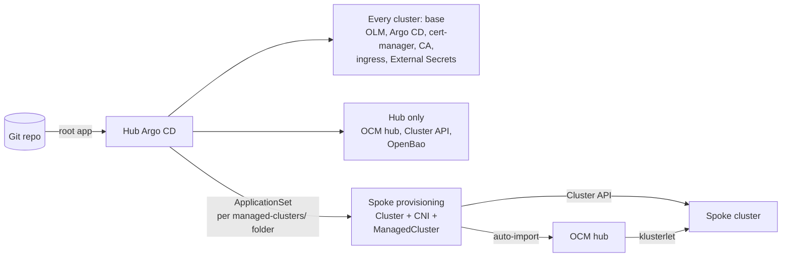

# OpenShift fleet GitOps (app-of-apps + Kustomize)

A GitOps repository for running a **fleet of Kubernetes clusters from one hub**, in the same way
OpenShift, Red Hat Advanced Cluster Management (RHACM) and OpenShift GitOps do it in production.
The hub creates clusters from Git and registers them. Handing each cluster over to its own Argo CD
is the next phase (see [Status](#status)).

The repository runs as a **lab on a laptop** (k3d, no domain, no Red Hat subscription), using the
open-source upstream of every product. Every pattern maps one-to-one to real OpenShift + RHACM.
To create child clusters in vCenter from Git with an existing RHACM hub (proof of concept), see
[docs/openshift-implementation.md](docs/openshift-implementation.md).
To run the secret chain (OpenBao, External Secrets Operator, secrets for applications) on
OpenShift, see [docs/openshift-secrets-openbao-eso.md](docs/openshift-secrets-openbao-eso.md).

## How it works



1. **Bootstrap once.** `scripts/bootstrap.sh` creates the hub, installs OLM and the Argo CD
   operator, and installs a small Helm chart with a `root` Application. From then on, Git owns
   the cluster.
2. **App of apps.** `root` renders `helm/infra`, which creates the `infra` Application. `infra`
   points to the cluster's Kustomize overlay, and every entry in the overlay is itself an Argo CD
   Application. Sync waves order them.
3. **A new cluster is a new folder.** An ApplicationSet on the hub turns every folder in the
   hub's inventory, `cluster/overlays/<hub>/managed-clusters/<cluster>/`, into an Application. That
   Application creates the cluster, installs its network, and registers it in Open Cluster
   Management (OCM).
4. **Zero-touch join.** OCM imports the new cluster automatically, and it reports as
   `JOINED` / `AVAILABLE` on the hub.

## Repository layout

```
cluster/
├── base/                                  # Argo CD Applications every cluster gets (wave)
│   ├── kustomization.yaml
│   ├── olm.yaml                           # -10  OLM (built into OpenShift)
│   ├── argocd.yaml                        #  -5  Argo CD (= OpenShift GitOps)
│   ├── cert-manager.yaml                  #  -3  cert-manager operator via OLM
│   ├── lab-ca.yaml                        #  -2  internal CA (= corporate CA issuer)
│   ├── gateway-api.yaml                   #  -2  Gateway API CRDs (lab only: OpenShift ships them)
│   ├── sail-operator.yaml                 #  -1  Istio operator via OLM (= OpenShift Service Mesh)
│   ├── external-secrets.yaml              #  -1  External Secrets Operator
│   ├── ingress.yaml                       #   0  Gateway for *.apps (= OpenShift router)
│   └── argocd-route.yaml                  #   1  Argo CD UI through the Gateway
├── applications/                          # WHAT is installed: manifests and charts
│   ├── cert-manager/                      # Subscription
│   ├── lab-ca/                            # self-signed root + ClusterIssuer lab-ca
│   ├── sail-operator/                     # Subscription
│   ├── ingress/                           # Istio, GatewayClass, Gateway, wildcard cert, redirect
│   ├── argocd-route/                      # HTTPRoute
│   ├── ocm-hub/                           # OCM hub via OLM (= RHACM)
│   ├── openbao/                           # wrapper Helm chart: OpenBao + ESO connection
│   │   ├── Chart.yaml                     # dependency: upstream openbao chart
│   │   ├── Chart.lock
│   │   ├── values.yaml                    # upstream values under "openbao:"
│   │   └── templates/
│   │       ├── certificate.yaml           # TLS from lab-ca
│   │       ├── tlsroute.yaml              # UI through the Gateway (TLS passthrough)
│   │       ├── serviceaccount.yaml        # identity ESO logs in with
│   │       └── clustersecretstore.yaml    # ESO -> OpenBao
│   └── secret-demo/                       # ExternalSecret demo
└── overlays/
    └── k3d-hub-01/                        # the hub
        ├── k3d-cluster.yaml               # how the hub itself is created
        ├── kustomization.yaml             # ../../base + the files below
        ├── ocm-hub.yaml                   # 0  Application: OCM hub
        ├── capi.yaml                      # 1  Application: Cluster API (= Hive)
        ├── openbao.yaml                   # 1  Application: OpenBao chart (hub only)
        ├── spoke-provisioning.yaml        # 2  ApplicationSet over managed-clusters/*
        ├── secret-demo.yaml               # 3  Application: ESO demo
        ├── patch/argocd-patch.yaml
        ├── managed-clusters/              # applied to the HUB: the clusters this hub owns
        │   └── k3d-spoke-01/              # how this spoke is created and registered
        │       ├── kustomization.yaml
        │       ├── namespace.yaml
        │       ├── cluster.yaml           # Cluster API Cluster (= Hive ClusterDeployment)
        │       ├── controlplane.yaml      # (= install-config / MachinePool)
        │       ├── cni.yaml
        │       ├── cni/kindnet.yaml       # pod network (= networkType in install-config)
        │       ├── managedcluster.yaml    # identical API in RHACM
        │       └── import-rbac.yaml
        └── helm/
            ├── bootstrap/                 # installed once with helm: root app, AppProject
            └── infra/                     # creates the infra Application
docs/
├── openshift-implementation.md            # child clusters from Git on an existing RHACM hub
└── openshift-secrets-openbao-eso.md       # OpenBao + External Secrets on OpenShift
scripts/
├── bootstrap.sh                           # create a lab cluster and hand it to Git
└── openbao-configure.sh                   # KV, Kubernetes auth, policies in OpenBao
```

**Every app is two things:** what is installed lives in `cluster/applications/<app>/`, and
*that* it is installed on a cluster (and in which wave) is an Argo CD Application in `base/`
(every cluster) or in the cluster's overlay (only that cluster). OpenBao is hub-only: there is
one secret store for the whole fleet, and the ESO connection to it ships in the same chart.

**A folder belongs to the cluster it is applied to.** How a spoke is created is applied to the
hub, so it lives in the hub's `managed-clusters/` inventory. What runs on the spoke will live in
the spoke's own overlay, `cluster/overlays/<cluster>/`, from the next phase (see Status). The
hub's ApplicationSet only reads its own inventory, so a second hub never picks up clusters it does
not own, and `managed-clusters/` is the one path to protect with review. Three kinds of
configuration are kept apart:

| What | Applied to | By |
|---|---|---|
| How the cluster is **created and registered** (`<hub>/managed-clusters/<cluster>/`) | The hub | The hub's Argo CD, through the ApplicationSet |
| What **runs inside** the cluster (`overlays/<cluster>/`, `base` + patches) | The cluster itself | The cluster's own Argo CD (next phase) |
| **Credentials** for creating clusters (vCenter, pull secret, install-config) | The hub, into the cluster's namespace | By hand for now, never in Git. Later from a secret store through External Secrets, with the same Secret names |

**`base` is what every cluster must have, not a menu.** Optional apps live in
`cluster/applications/`, and a cluster lists them in its own `kustomization.yaml`. If one cluster
needs to skip something from `base`, use a delete patch in that cluster's `patch/` folder, with a
comment that says why:

```yaml
# cluster/overlays/<cluster>/patch/remove-cert-manager.yaml
$patch: delete
apiVersion: argoproj.io/v1alpha1
kind: Application
metadata:
  name: cert-manager
  namespace: openshift-gitops
```

Kustomize fails the build if the patch matches nothing, so a typo shows up in the pull request.
When many clusters skip the same app, move it out of `base` instead.

## Lab to production mapping

| Production (OpenShift + RHACM on vSphere) | This lab |
|---|---|
| OpenShift cluster | k3d (hub), Cluster API Docker clusters (spokes) |
| OLM (built in) | OLM installed as an Argo CD Application |
| OpenShift GitOps operator | Upstream Argo CD operator via the `gitops-operator` chart |
| cert-manager Operator for Red Hat OpenShift | Upstream cert-manager operator via OLM |
| Corporate CA (ADCS / Vault PKI) `ClusterIssuer` | Self-signed root + `ClusterIssuer` `lab-ca` |
| OpenShift router, Routes, Gateway API (Ingress Operator + Service Mesh) | Gateway API served by Istio (Sail Operator via OLM), same `GatewayClass` name |
| Corporate Vault | OpenBao (Helm wrapper chart, Raft, TLS from `lab-ca`) |
| External Secrets Operator for Red Hat OpenShift (OLM) | Upstream External Secrets Operator (Helm; the OperatorHub.io package is outdated) |
| RHACM / MultiClusterHub | Open Cluster Management `ClusterManager` |
| Hive `ClusterDeployment` on vSphere | Cluster API `Cluster` + Docker provider |
| `networkType: OVNKubernetes` in install-config | kindnet via `ClusterResourceSet` |
| ACM import controller (built in) | OCM `ClusterImporter` feature gate |
| `ManagedCluster` | `ManagedCluster` (same API) |
| vCenter credentials, pull secret and install-config: from Vault through ESO | Not needed: Docker needs no credentials |
| Internal Git server | GitHub (public, so no environment data or secrets) |

## Safety rails

- **Clusters are never deleted by Git by accident.** The ApplicationSet uses
  `preserveResourcesOnDeletion`. Its Applications have no resources finalizer. `Cluster` and
  `ManagedCluster` carry `Prune=false,Delete=false`.
- **The infra layer is fenced.** The `infra` AppProject may only create `Application` and
  `ApplicationSet` objects. The project is installed by Helm, so Git cannot remove its own
  guardrails.
- **Pinned versions everywhere.** Charts, operators, Kubernetes and the CNI image all have fixed
  versions, so a rebuilt cluster is identical to the old one.
- **No secrets in Git.** Kubeconfigs, keys and local values files are ignored (see `.gitignore`).
  Local-only values use the `*.local.yaml` suffix.
- **Every change goes through a pull request.** Run `kubectl kustomize <path>` before committing.
  If it fails locally, it fails in Argo CD.

## Running the lab

**Requirements:** Docker, `k3d`, `kubectl`, `helm`, `yq`, `git`, and about 12 GB of free RAM.

Several clusters share the host kernel, so raise the inotify limits first. Without this,
kube-proxy on the spokes crashes with `too many open files`:

```bash
sudo tee /etc/sysctl.d/99-kubernetes-lab.conf <<'EOF'
fs.inotify.max_user_instances = 512
fs.inotify.max_user_watches = 524288
EOF
sudo sysctl --system
```

**Create the hub:**

```bash
scripts/bootstrap.sh k3d-hub-01
kubectl -n openshift-gitops get applications
```

**Trust the lab CA** (once per hub rebuild), so the browser and `curl` accept the certificates:

```bash
kubectl -n operators get secret lab-root-ca -o jsonpath='{.data.ca\.crt}' | base64 -d > ~/lab-root-ca.crt
sudo cp ~/lab-root-ca.crt /usr/local/share/ca-certificates/lab-root-ca.crt && sudo update-ca-certificates
```

Import `~/lab-root-ca.crt` in the browser as a certificate authority too.

**Open the Argo CD UI** at <https://argocd.apps.hub.127.0.0.1.nip.io> and log in as `admin`:

```bash
kubectl -n openshift-gitops get secret argocd-cluster -o jsonpath='{.data.admin\.password}' | base64 -d; echo
```

**Initialize OpenBao** (first time only). The keys go to a file outside the repository:

```bash
umask 077
kubectl -n openbao exec openbao-0 -- bao operator init -key-shares=5 -key-threshold=3 -format=json > ~/openbao-init.json
scripts/openbao-configure.sh
```

**Unseal OpenBao** after every restart of its pod:

```bash
for i in 0 1 2; do
  jq -j ".unseal_keys_b64[$i]" ~/openbao-init.json \
    | kubectl -n openbao exec -i openbao-0 -- bao write -format=json sys/unseal key=- | jq -c '{sealed: .data.sealed}'
done
```

The UI is at <https://openbao.apps.hub.127.0.0.1.nip.io>.

**Follow a spoke being created:**

```bash
kubectl -n k3d-spoke-01 get cluster,kubeadmcontrolplane,machines
kubectl get managedclusters        # JOINED and AVAILABLE become True
```

**Reach the spoke.** The kubeconfig is an admin credential, so keep it outside the repo:

```bash
kubectl -n k3d-spoke-01 get secret k3d-spoke-01-kubeconfig -o jsonpath='{.data.value}' \
  | base64 -d > /tmp/k3d-spoke-01.kubeconfig
kubectl --kubeconfig /tmp/k3d-spoke-01.kubeconfig get nodes
```

## Status

| Phase | State |
|---|---|
| Hub: OLM, Argo CD, app of apps | Done |
| cert-manager | Done |
| OCM hub + Cluster API | Done |
| Spoke provisioning from Git, CNI, auto-import into OCM | Done |
| cert-manager via OLM, internal CA | Done |
| Gateway API ingress (Istio), Argo CD through the Gateway | Done |
| OpenBao + External Secrets, `ClusterSecretStore` in the OpenBao chart | Done |
| `ClusterExternalSecret`, lab root CA key in OpenBao | Next |
| Argo CD + root app on the spoke, installed by the hub | Planned |
| Security: OIDC login, OCM governance policies, NetworkPolicies | Planned |
| Backup and restore (Velero), disconnected mirror | Planned |
| Monitoring and logging | Later |

**Known lab limitations:**
- Spokes are vanilla Kubernetes, so there are no Routes, SCCs or other OpenShift-only APIs.
- The Cluster API Docker load balancer listens on `0.0.0.0`.
- After a restart of Docker, start the spoke again: `docker start $(docker ps -aq --filter name=k3d-spoke-01)`.
- The cluster domain (`apps.hub.127.0.0.1.nip.io`) is still written in `base`; it becomes a
  per-cluster patch when spokes get `base`.
