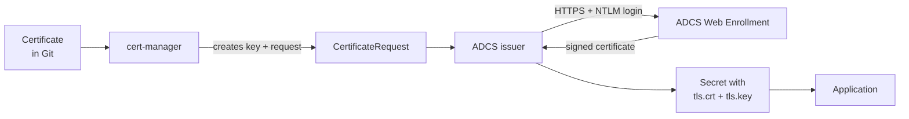

# Certificates on OpenShift with cert-manager and Active Directory Certificate Services

When you are done, any application on the cluster can get a TLS certificate signed by your own
company CA (Active Directory Certificate Services, ADCS) just by adding a small `Certificate` file
to Git. Certificates are renewed automatically before they expire, and nobody has to request
them by hand.

This guide is written for a **disconnected cluster**: a new OpenShift cluster created by RHACM,
in its own network and vCenter, with **no internet access**. Everything it needs comes from
internal services: the mirror registry, the internal Helm repository, the internal Git server and
ADCS.

Run every command from the root of the Git repository, logged in (`oc login`) to the **new
cluster**. Each step explains **what** you do and **why**, and ends with a **Check**. Do not
start the next step until the check passes.

---

## Step 0: Understand where the files go

Read this once before you start. Everything else in the guide builds on it.

### The cluster's own Argo CD reads one folder

The new cluster has its own Argo CD (OpenShift GitOps). It watches **one folder** in Git: the
cluster's own folder, `cluster/overlays/<cluster>/`. Whatever is listed in that folder's
`kustomization.yaml` ends up on the cluster. Nothing else does.

```
cluster/overlays/ocp-poc-01/          ← the cluster's folder. Its Argo CD reads only this.
├── kustomization.yaml                ← the list of apps on this cluster
└── apps/
    └── cert-manager/                 ← one folder per app. This guide creates this one.
```

To add an app to a cluster you do two things: create the app's folder, and add it to the list.

### One app = one folder, with everything that belongs to it

cert-manager is not one thing but three that only make sense together: cert-manager itself, the
plug-in that talks to ADCS, and the connection to ADCS. So they live in **one** folder:

```
apps/cert-manager/
├── kustomization.yaml          ← lists the Application files below (and only those)
│
├── cert-manager.yaml           ← Application: "install what is in ./operator"
├── operator/                   ←   cert-manager itself (from the operator catalog)
│
├── adcs-issuer.yaml            ← Application: "install the ADCS plug-in's Helm chart"
│                                    (no folder: the chart comes from the Helm repo)
│
├── adcs-issuer-config.yaml     ← Application: "install what is in ./adcs"
├── adcs/                       ←   the connection to ADCS: URL, template, CA
│
├── cluster-trust.yaml          ← Application: "install what is in ./trust"
└── trust/                      ←   makes the cluster trust the company CA
```

Two kinds of files, and the difference matters:

| Kind | What it is | Example |
|---|---|---|
| **Application file** (`*.yaml` directly in the app folder) | An instruction to Argo CD: *"install this folder (or this Helm chart) on the cluster"* | `cert-manager.yaml` |
| **Content** (the files in a subfolder) | What actually gets installed | `operator/operator.yaml` |

The app folder's `kustomization.yaml` lists **only the Application files**. Each Application then
installs its own subfolder. That is the whole "app of apps" idea: Argo CD installs Applications,
and each Application installs one part.

### The order: sync waves

The parts depend on each other. The plug-in needs cert-manager, the ADCS connection needs the
plug-in. Each Application file has a **sync wave** number. Argo CD installs the lowest number
first, waits until it is healthy, then goes on to the next:

| Wave | Application | Installs | Needs |
|---|---|---|---|
| -3 | `cert-manager.yaml` | cert-manager | nothing |
| -2 | `adcs-issuer.yaml` | the ADCS plug-in | cert-manager |
| -2 | `cluster-trust.yaml` | trust of the company CA | nothing |
| -1 | `adcs-issuer-config.yaml` | the ADCS connection | the plug-in, which brings the `ClusterAdcsIssuer` type |

### See the result before anything happens

At any time you can ask Git what the cluster's Argo CD will see. Nothing is installed by this:

```bash
oc kustomize cluster/overlays/<cluster>                      # the list of Applications
oc kustomize cluster/overlays/<cluster>/apps/cert-manager/operator   # what one Application installs
```

---

## How cert-manager and ADCS work together

| Part | What it does |
|---|---|
| **cert-manager** | Watches `Certificate` objects. Creates a private key and a certificate request for each, and renews the certificate before it expires. |
| **ADCS issuer** | A plug-in for cert-manager. It sends the certificate request to ADCS and brings the signed certificate back. |
| **ADCS Web Enrollment** | The ADCS web page (`https://<server>/certsrv`) that the ADCS issuer talks to. |
| **Certificate template** | A setting in ADCS that decides what kind of certificate you get: how long it is valid, what it may be used for. |



The private key is created inside the cluster and never leaves it. ADCS only sees the request.

---

## Before you start

### The cluster's own Argo CD

The new cluster must already have OpenShift GitOps reading `cluster/overlays/<cluster>/`. Check:

```bash
oc -n openshift-gitops get applications       # an Application that points at cluster/overlays/<cluster>
```

### From the Active Directory team

| # | What | Why |
|---|---|---|
| 1 | The **Web Enrollment URL**, for example `https://adcs.example.internal/certsrv`. | This is where the ADCS issuer sends requests. |
| 2 | A **certificate template** for server certificates. It must allow *Server Authentication*, and the subject and names must be *supplied in the request*. | The template controls what you are allowed to get. Without "supplied in the request", ADCS ignores the names you ask for. |
| 3 | A **service account** in Active Directory with *Read* and *Enroll* rights on that template, and NTLM allowed on the Web Enrollment site. | The ADCS issuer logs in as this account. |
| 4 | The **CA certificates** (root and issuing CA) as PEM files. | So the cluster can trust ADCS's web site and the certificates it signs. A CA certificate is public, so it is safe to keep in Git. |
| 5 | Whether the template needs a **manager approval** in ADCS. | If yes, every request waits until someone approves it in ADCS. Ask for a template without manual approval. |

### From whoever runs the mirror

A disconnected cluster can only use what has been copied (mirrored) into your internal services:

| What | Where | Why |
|---|---|---|
| The operator `openshift-cert-manager-operator` | The mirrored operator catalog (`oc-mirror`), including its images | OLM installs the operator from the catalog |
| The image `docker.io/djkormo/adcs-issuer:2.2.2` | The mirror registry, as `<registry>/djkormo/adcs-issuer:2.2.2` | The ADCS issuer pod runs it |
| The Helm chart `adcs-issuer` 2.2.2 (from `https://djkormo.github.io/adcs-issuer/`) | The internal Helm repository | Argo CD installs the ADCS issuer from it |

### From the network team

The new cluster lives in its own network. These connections must be open (firewall) and the names
must resolve (DNS) **from the new cluster's machine network**:

| From | To | Port | Why |
|---|---|---|---|
| Cluster nodes | Mirror registry | 443 | Pull the operator and ADCS issuer images |
| Cluster nodes | ADCS Web Enrollment server | 443 | Request certificates |
| Cluster nodes | DNS server that knows the ADCS and registry names | 53 | Find them by name |
| Cluster nodes | NTP server | 123 (UDP) | Correct time. Wrong time breaks NTLM logins and makes certificates look "not yet valid" or expired. |
| The cluster's Argo CD | Internal Git server and Helm repository | 443 | Read the files in this guide and the ADCS issuer chart |

---

## Step 1: Fill in your values

Change the values to match your environment, then paste the block into your terminal. Every later
step uses these variables.

```bash
export CLUSTER=ocp-poc-01                                           # the cluster's folder name under cluster/overlays/
export REGISTRY=registry.example.internal                           # mirror registry
export CHART_REPO=https://charts.example.internal/repository/helm   # internal Helm repo
export GIT_REPO=https://git.example.internal/platform/fleet.git
export ADCS_URL=https://adcs.example.internal/certsrv               # Active Directory team, item 1
export ADCS_TEMPLATE=OpenShiftWebServer                             # Active Directory team, item 2
export CA_CHAIN=corporate-ca-chain.pem                              # item 4: root + issuing CA in one file
export CATALOG=cs-redhat-operator-index                             # the mirrored catalog, see Check 2

export APP=cluster/overlays/$CLUSTER/apps/cert-manager              # the app folder this guide creates
```

**Check 1:** the CA file contains certificates and nothing else:

```bash
grep -c 'BEGIN CERTIFICATE' $CA_CHAIN     # 2 or more
grep -c 'PRIVATE KEY' $CA_CHAIN           # must be 0
```

**Check 2:** the cluster uses the mirrored catalog, and the operator is in it:

```bash
oc get catalogsource -n openshift-marketplace          # the mirrored catalog: put its NAME in $CATALOG
oc get packagemanifest openshift-cert-manager-operator -n openshift-marketplace \
  -o jsonpath='catalog: {.status.catalogSource}{"\n"}channel: {.status.defaultChannel}{"\n"}'
```

The second command prints your mirrored catalog and a channel, for example `stable-v1`. If it says
`not found`, the operator is not mirrored: ask whoever runs the mirror.

**Check 3:** the cluster knows where the mirrored operator images are:

```bash
oc get imagedigestmirrorset -o yaml | grep -c 'registry.redhat.io'        # more than 0
oc get imagecontentsourcepolicy -o yaml | grep -c 'registry.redhat.io'    # older clusters use this instead
```

`oc-mirror` creates these mappings. Without them, OLM tries to pull from `registry.redhat.io` on
the internet and the installation hangs.

---

## Step 2: Test the network from inside the cluster

**What:** check, from one of the cluster's own nodes, that ADCS can be reached and the login works.

**Why:** the cluster is in a different network than your workstation. A test from your
workstation proves nothing about what the cluster can reach.

```bash
NODE=$(oc get nodes -l node-role.kubernetes.io/worker -o name | head -1)
oc debug $NODE
```

You now have a shell on the node. Run these inside it (`chroot /host` gives you the node's own
tools), then `exit` twice:

```bash
chroot /host
getent hosts adcs.example.internal                        # DNS: prints an IP address
chronyc tracking | grep -E 'Reference|System time'        # time: a reference server, small offset
curl --ntlm -u 'EXAMPLE\svc-ocp-certs' -k -s -o /dev/null -w '%{http_code}\n' https://adcs.example.internal/certsrv/
```

| Result | Meaning |
|---|---|
| `200` | Network, DNS and login work. |
| `401` | The network works, but the username, password or NTLM setting is wrong. |
| `000` or a timeout | The firewall blocks the cluster from ADCS. Ask the network team. |
| `getent` prints nothing | DNS on the cluster cannot resolve the ADCS name. |

(`-k` skips the certificate check in this test only. The real setup checks it with `$CA_CHAIN`.)

---

## Step 3: cert-manager itself

**What:** the app folder, and in it the first part: Red Hat's cert-manager operator from the
**mirrored** catalog.

**Files you create in this step:**

```
apps/cert-manager/
├── kustomization.yaml          ← lists cert-manager.yaml (more are added in later steps)
├── cert-manager.yaml           ← Application, wave -3: "install ./operator"
└── operator/
    ├── kustomization.yaml
    └── operator.yaml           ← Namespace, OperatorGroup, Subscription
```

**Why the namespace `cert-manager-operator`?** On OpenShift you can put operators in the shared
namespace `openshift-operators`, or give each operator its own. This guide gives cert-manager its
own, because:

- it is the namespace the operator itself recommends,
- with `installPlanApproval: Manual`, one approval covers all operators in the same namespace. With
  one namespace per operator, you upgrade one operator at a time,
- removing or troubleshooting one operator does not touch the others.

```bash
mkdir -p $APP/operator

# Content: what OLM needs to install the operator
cat > $APP/operator/operator.yaml <<EOF
apiVersion: v1
kind: Namespace
metadata:
  name: cert-manager-operator
---
apiVersion: operators.coreos.com/v1
kind: OperatorGroup
metadata:
  name: cert-manager-operator
  namespace: cert-manager-operator
spec:
  targetNamespaces:
    - cert-manager-operator
---
apiVersion: operators.coreos.com/v1alpha1
kind: Subscription
metadata:
  name: openshift-cert-manager-operator
  namespace: cert-manager-operator
spec:
  name: openshift-cert-manager-operator
  channel: stable-v1
  # The mirrored catalog (Step 1, Check 2), not redhat-operators: there is no internet
  source: $CATALOG
  sourceNamespace: openshift-marketplace
  installPlanApproval: Manual
EOF

cat > $APP/operator/kustomization.yaml <<'EOF'
apiVersion: kustomize.config.k8s.io/v1beta1
kind: Kustomization
resources:
  - operator.yaml
EOF

# Application: tells Argo CD to install ./operator, first of all (wave -3)
cat > $APP/cert-manager.yaml <<EOF
apiVersion: argoproj.io/v1alpha1
kind: Application
metadata:
  name: cert-manager
  namespace: openshift-gitops
  annotations:
    argocd.argoproj.io/sync-wave: "-3"
spec:
  project: default
  source:
    repoURL: $GIT_REPO
    targetRevision: main
    path: $APP/operator
  destination:
    server: https://kubernetes.default.svc
  syncPolicy:
    automated:
      selfHeal: true
    syncOptions:
      - ServerSideApply=true
EOF

# The app folder's list: only Application files
cat > $APP/kustomization.yaml <<'EOF'
apiVersion: kustomize.config.k8s.io/v1beta1
kind: Kustomization
resources:
  - cert-manager.yaml
EOF
```

**Put the app on the cluster's list.** Open `cluster/overlays/$CLUSTER/kustomization.yaml` and add
the folder under `resources:`:

```yaml
resources:
  - apps/cert-manager
```

**Check** before you commit: the cluster's list now contains the Application, and the Application's
content renders:

```bash
oc kustomize cluster/overlays/$CLUSTER | grep -E '^  name: cert-manager$'
oc kustomize $APP/operator | grep -E '^kind:'           # Namespace, OperatorGroup, Subscription
```

Commit, open a pull request and merge it. Then approve the installation (it waits for you because
of `installPlanApproval: Manual`, so nothing is ever upgraded without you deciding it):

```bash
oc -n cert-manager-operator get installplan
oc -n cert-manager-operator patch installplan <NAME> --type merge -p '{"spec":{"approved":true}}'
```

**Check:**

```bash
oc -n cert-manager-operator get csv          # PHASE Succeeded
oc -n cert-manager get pods                  # cert-manager, cert-manager-cainjector, cert-manager-webhook: Running
```

If a pod stays in `ImagePullBackOff`, the image mappings from Step 1, Check 3 are missing.

---

## Step 4: The ADCS plug-in

**What:** the plug-in that connects cert-manager to ADCS, from its Helm chart in your internal Helm
repo, with its image from the mirror registry.

**Files you create in this step:**

```
apps/cert-manager/
├── kustomization.yaml          ← + adcs-issuer.yaml
└── adcs-issuer.yaml            ← Application, wave -2: "install the adcs-issuer Helm chart"
```

**Why no subfolder?** The plug-in is delivered as a Helm chart, so the Application points straight
at the chart in the Helm repo. Its settings (`helm.valuesObject`) are written directly in the
Application file: the image comes from the mirror registry by its full name, so it does not need
any image mappings.

```bash
cat > $APP/adcs-issuer.yaml <<EOF
apiVersion: argoproj.io/v1alpha1
kind: Application
metadata:
  name: adcs-issuer
  namespace: openshift-gitops
  annotations:
    # After cert-manager (-3)
    argocd.argoproj.io/sync-wave: "-2"
spec:
  project: default
  source:
    repoURL: $CHART_REPO
    chart: adcs-issuer
    targetRevision: 2.2.2
    helm:
      releaseName: adcs-issuer
      valuesObject:
        # Creates the security context constraint (SCC) the plug-in needs on OpenShift
        openshift:
          enabled: true
        controllerManager:
          manager:
            image:
              # Full name in the mirror registry: no internet needed
              repository: $REGISTRY/djkormo/adcs-issuer
              tag: 2.2.2
              imagePullPolicy: IfNotPresent
        metricsService:
          serviceMonitor:
            enabled: false
  destination:
    server: https://kubernetes.default.svc
    namespace: adcs-issuer
  syncPolicy:
    automated:
      selfHeal: true
    syncOptions:
      - CreateNamespace=true
      - ServerSideApply=true
EOF

cat > $APP/kustomization.yaml <<'EOF'
apiVersion: kustomize.config.k8s.io/v1beta1
kind: Kustomization
resources:
  - cert-manager.yaml
  - adcs-issuer.yaml
EOF
```

**Check** before you commit (only your registry may appear):

```bash
yq '.spec.source.helm.valuesObject' $APP/adcs-issuer.yaml > /tmp/adcs-values.yaml
helm template adcs-issuer adcs-issuer --repo $CHART_REPO --version 2.2.2 -n adcs-issuer \
  -f /tmp/adcs-values.yaml | grep 'image:' | sort -u
```

Commit, open a pull request and merge it. If your Helm repo needs a login, add it once in the
Argo CD UI: **Settings → Repositories → Connect Repo**, type **Helm**.

**Check** after the merge:

```bash
oc -n adcs-issuer get pods                  # one pod adcs-issuer-... Running
oc get crd | grep adcs.certmanager           # adcsissuers, adcsrequests, clusteradcsissuers
```

If the pod stays in `ImagePullBackOff`: the image is not in the mirror registry, or the cluster's
pull secret has no login for it (`oc get secret pull-secret -n openshift-config`).

---

## Step 5: Give the plug-in its ADCS login

**What:** a Secret with the service account's username and password.

**Why by hand, and not in the folder:** a password never goes into Git. The Secret must be in the
`adcs-issuer` namespace, because that is where the plug-in looks for it. (When a secret store such
as OpenBao is in place, this Secret can come from there instead, under the same name.)

```bash
read -rsp 'Password for the ADCS service account: ' PW; echo
oc -n adcs-issuer create secret generic adcs-issuer-credentials \
  --from-literal=username='EXAMPLE\svc-ocp-certs' \
  --from-literal=password="$PW"
unset PW
```

Use the same username format that worked in Step 2 (`DOMAIN\user`).

**Check:**

```bash
oc -n adcs-issuer get secret adcs-issuer-credentials -o jsonpath='{.data}' | jq 'keys'
```

It shows `["password","username"]`.

---

## Step 6: The connection to ADCS

**What:** a `ClusterAdcsIssuer` named `adcs`. It tells the plug-in where ADCS is, which template
to use and which login to use. "Cluster" means every namespace on the cluster can use it.

**Files you create in this step:**

```
apps/cert-manager/
├── kustomization.yaml          ← + adcs-issuer-config.yaml
├── adcs-issuer-config.yaml     ← Application, wave -1: "install ./adcs"
└── adcs/
    ├── kustomization.yaml
    └── clusteradcsissuer.yaml  ← URL, template, login, CA
```

**Why wave -1:** the `ClusterAdcsIssuer` type is created by the plug-in (Step 4, wave -2), so this
must come after it.

**Why `caBundle`:** the plug-in talks HTTPS to the Web Enrollment site and must trust its
certificate. `caBundle` is the CA chain from Step 1, base64-encoded.

```bash
mkdir -p $APP/adcs

cat > $APP/adcs/clusteradcsissuer.yaml <<EOF
apiVersion: adcs.certmanager.csf.nokia.com/v1
kind: ClusterAdcsIssuer
metadata:
  name: adcs
spec:
  url: $ADCS_URL
  templateName: $ADCS_TEMPLATE
  credentialsRef:
    name: adcs-issuer-credentials
  caBundle: $(base64 -w0 $CA_CHAIN)
  statusCheckInterval: 5m
  retryInterval: 5m
EOF

cat > $APP/adcs/kustomization.yaml <<'EOF'
apiVersion: kustomize.config.k8s.io/v1beta1
kind: Kustomization
resources:
  - clusteradcsissuer.yaml
EOF

cat > $APP/adcs-issuer-config.yaml <<EOF
apiVersion: argoproj.io/v1alpha1
kind: Application
metadata:
  name: adcs-issuer-config
  namespace: openshift-gitops
  annotations:
    # After adcs-issuer (-2), which installs the ClusterAdcsIssuer type
    argocd.argoproj.io/sync-wave: "-1"
spec:
  project: default
  source:
    repoURL: $GIT_REPO
    targetRevision: main
    path: $APP/adcs
  destination:
    server: https://kubernetes.default.svc
  syncPolicy:
    automated:
      selfHeal: true
    syncOptions:
      - ServerSideApply=true
EOF

cat > $APP/kustomization.yaml <<'EOF'
apiVersion: kustomize.config.k8s.io/v1beta1
kind: Kustomization
resources:
  - cert-manager.yaml
  - adcs-issuer.yaml
  - adcs-issuer-config.yaml
EOF
```

Commit, open a pull request and merge it.

**Check:**

```bash
oc get clusteradcsissuer adcs
oc -n adcs-issuer logs deploy/adcs-issuer --tail=20 | grep -i error
```

The issuer exists, and the log shows no errors. The issuer has no "ready" status of its own: it
only talks to ADCS when a certificate is requested, so the real test is Step 7.

---

## Step 7: Test with a certificate

**What:** ask for one real certificate in a test namespace, look at it, then remove it. This test
is done by hand and is **not** put in Git.

**Why:** this proves the whole chain (cert-manager → plug-in → ADCS → back) before any
application depends on it.

```bash
oc create namespace cert-test
oc apply -f - <<'EOF'
apiVersion: cert-manager.io/v1
kind: Certificate
metadata:
  name: test
  namespace: cert-test
spec:
  secretName: test-tls
  commonName: cert-test.example.internal
  dnsNames:
    - cert-test.example.internal
  privateKey:
    algorithm: RSA
    size: 2048
  issuerRef:
    group: adcs.certmanager.csf.nokia.com
    kind: ClusterAdcsIssuer
    name: adcs
EOF
```

**Check** (it can take a minute):

```bash
oc -n cert-test get certificate test         # READY True
oc -n cert-test get secret test-tls -o jsonpath='{.data.tls\.crt}' | base64 -d \
  | openssl x509 -noout -subject -issuer -dates -ext subjectAltName
```

The issuer is your company CA, and the name `cert-test.example.internal` is in the list.

If `READY` stays `False`, follow the request step by step:

```bash
oc -n cert-test get certificaterequest       # APPROVED True? READY?
oc -n cert-test get adcsrequest              # STATE: pending, ready, errored or rejected
oc -n cert-test describe adcsrequest | tail -5
oc -n adcs-issuer logs deploy/adcs-issuer --tail=30
```

Clean up:

```bash
oc delete namespace cert-test
```

The test certificate stays valid in ADCS until it expires. Ask the ADCS team to revoke it if your
rules require that.

---

## Step 8: Make the cluster trust the company CA

**What:** make sure the company CA is in the cluster's list of trusted CAs.

**Why:** the certificates are now signed by your company CA. Components inside the cluster (the
OAuth server, image pulls, and anything that reads the injected trust bundle, for example the
OpenBao guide) must trust that CA, or they fail with `x509: certificate signed by unknown authority`.

> **Easiest for new clusters:** add the company CA to `additionalTrustBundle` in the cluster's
> `install-config.yaml`, next to the mirror registry's CA, when RHACM creates the cluster. Then it
> is trusted from the first boot and this step is only a check.

**On a disconnected cluster this list already exists.** The installer created it with the mirror
registry's CA, so the cluster can pull images. Never replace it: **add** the company CA to it.

```bash
BUNDLE=$(oc get proxy cluster -o jsonpath='{.spec.trustedCA.name}'); echo "$BUNDLE"   # usually user-ca-bundle
oc -n openshift-config get configmap $BUNDLE -o jsonpath='{.data.ca-bundle\.crt}' > current-bundle.pem
grep -c 'BEGIN CERTIFICATE' current-bundle.pem                                       # the CAs trusted today
```

Is the company CA already in it? Compare the subjects:

```bash
openssl crl2pkcs7 -nocrl -certfile current-bundle.pem | openssl pkcs7 -print_certs -noout | grep subject
openssl crl2pkcs7 -nocrl -certfile $CA_CHAIN          | openssl pkcs7 -print_certs -noout | grep subject
```

If every subject from `$CA_CHAIN` is already in the first list, you are done: skip the rest of
this step. Otherwise put the **combined** bundle in the app folder, under the **same name**, so it
is managed from Git from now on.

**Files you create in this step:**

```
apps/cert-manager/
├── kustomization.yaml          ← + cluster-trust.yaml
├── cluster-trust.yaml          ← Application, wave -2: "install ./trust"
└── trust/
    ├── kustomization.yaml
    └── trusted-ca-bundle.yaml  ← the mirror registry's CA + the company CA
```

```bash
mkdir -p $APP/trust

cat current-bundle.pem $CA_CHAIN > combined-bundle.pem
oc create configmap $BUNDLE -n openshift-config --from-file=ca-bundle.crt=combined-bundle.pem \
  --dry-run=client -o yaml > $APP/trust/trusted-ca-bundle.yaml
rm current-bundle.pem combined-bundle.pem

cat > $APP/trust/kustomization.yaml <<'EOF'
apiVersion: kustomize.config.k8s.io/v1beta1
kind: Kustomization
resources:
  - trusted-ca-bundle.yaml
EOF

cat > $APP/cluster-trust.yaml <<EOF
apiVersion: argoproj.io/v1alpha1
kind: Application
metadata:
  name: cluster-trust
  namespace: openshift-gitops
  annotations:
    argocd.argoproj.io/sync-wave: "-2"
spec:
  project: default
  source:
    repoURL: $GIT_REPO
    targetRevision: main
    path: $APP/trust
  destination:
    server: https://kubernetes.default.svc
  syncPolicy:
    automated:
      # Never delete the trust bundle: without it the cluster cannot pull images
      prune: false
      selfHeal: true
    syncOptions:
      - ServerSideApply=true
EOF

cat > $APP/kustomization.yaml <<'EOF'
apiVersion: kustomize.config.k8s.io/v1beta1
kind: Kustomization
resources:
  - cert-manager.yaml
  - adcs-issuer.yaml
  - adcs-issuer-config.yaml
  - cluster-trust.yaml
EOF
```

**Check** before you commit: the mirror registry's CA **and** the company CA are both in the new
file (the number is the sum of the two lists above):

```bash
grep -c 'BEGIN CERTIFICATE' $APP/trust/trusted-ca-bundle.yaml
```

Commit, open a pull request and merge it.

> A change to the trust bundle rolls through the nodes one by one, like a small upgrade. Do it in
> a maintenance window.

**Check** (after the nodes have updated, `oc get mcp` shows `UPDATED True`):

```bash
oc -n openshift-config get configmap $BUNDLE -o jsonpath='{.data.ca-bundle\.crt}' | grep -c 'BEGIN CERTIFICATE'
```

The number matches the file in Git, and images can still be pulled.

---

## Done: what you have built

```
cluster/overlays/<cluster>/
├── kustomization.yaml              ← resources: [apps/cert-manager]
└── apps/cert-manager/
    ├── kustomization.yaml          ← the four Application files
    ├── cert-manager.yaml           (wave -3) → operator/
    ├── operator/operator.yaml          Namespace, OperatorGroup, Subscription (mirrored catalog)
    ├── adcs-issuer.yaml            (wave -2) → Helm chart adcs-issuer 2.2.2, image from the mirror
    ├── cluster-trust.yaml          (wave -2) → trust/
    ├── trust/trusted-ca-bundle.yaml    mirror registry CA + company CA
    ├── adcs-issuer-config.yaml     (wave -1) → adcs/
    └── adcs/clusteradcsissuer.yaml     URL, template, login, CA
```

Plus one Secret created by hand: `adcs-issuer-credentials` in `adcs-issuer`.

**Another cluster?** Copy `apps/cert-manager/` to that cluster's folder, add it to its
`kustomization.yaml`, and change what differs in that network (`$REGISTRY`, `$CATALOG`,
`$ADCS_URL`, the trust bundle, and the paths that contain the cluster name). Then create its login
Secret (Step 5).

---

## Use it in your applications

Every certificate is a small file next to the application in Git. Only `issuerRef` points to ADCS:

```yaml
apiVersion: cert-manager.io/v1
kind: Certificate
metadata:
  name: myapp-tls
  namespace: myapp
spec:
  secretName: myapp-tls            # the Secret the application (or its Route) reads
  dnsNames:
    - myapp.apps.ocp-poc-01.example.internal
  privateKey:
    algorithm: RSA
    size: 2048
  issuerRef:
    group: adcs.certmanager.csf.nokia.com
    kind: ClusterAdcsIssuer
    name: adcs
```

Good to know:

- **Validity comes from the ADCS template**, not from `duration` in the file. cert-manager renews
  automatically when two thirds of the lifetime have passed.
- When another guide asks for an *issuer*, use these three values: group
  `adcs.certmanager.csf.nokia.com`, kind `ClusterAdcsIssuer`, name `adcs`.
- Use RSA keys unless you know the template accepts ECDSA.

---

## If something does not work

| What you see | What it means | What to do |
|---|---|---|
| Nothing happens on the cluster after the merge | The app is not on the cluster's list, or the cluster's Argo CD reads another folder | `oc kustomize cluster/overlays/$CLUSTER` must show the Application. Check "Before you start". |
| Subscription shows no install plan, or `no operators found` | The catalog in `source:` does not have the operator | Step 1, Check 2: use the mirrored catalog's name, and ask for the operator to be mirrored |
| Operator or cert-manager pods in `ImagePullBackOff` | The cluster tries to pull from the internet | Step 1, Check 3: the `ImageDigestMirrorSet` from `oc-mirror` is missing |
| ADCS issuer pod in `ImagePullBackOff` | Image not in the mirror registry, or no login for it | Check the image name in Step 4 and the cluster's pull secret |
| `adcs-issuer-config` stuck, `ClusterAdcsIssuer` type unknown | The plug-in (wave -2) is not healthy yet | Fix Step 4 first. Waves always wait for the previous one. |
| Plug-in log: `i/o timeout` or `no route to host` | The firewall blocks the cluster from ADCS | Step 2 and the network table |
| Plug-in log: `no such host` | The cluster's DNS cannot resolve the ADCS name | Step 2 and the network table |
| `certificate is not yet valid`, or NTLM logins fail although the password is right | The cluster's clock is wrong | Step 2: check `chronyc tracking`. The cluster needs an internal NTP server. |
| No `AdcsRequest` is created at all | The plug-in is not running, or the `issuerRef` is wrong | `oc -n adcs-issuer get pods`, and check group, kind and name in `issuerRef` |
| `CertificateRequest` shows `APPROVED` empty | cert-manager has not approved it | The chart gives cert-manager the right to approve ADCS requests. Check that cert-manager runs in the namespace `cert-manager` with the service account `cert-manager`. |
| `AdcsRequest` stays `pending` | ADCS waits for a manager to approve the request, or the plug-in cannot reach ADCS | Read the plug-in log. If ADCS is waiting for approval, ask the ADCS team, or ask them to remove manual approval from the template. |
| `AdcsRequest` is `rejected` or `errored` | ADCS refused the request, or the call failed | Usually the template: it does not allow names in the request, the key size is too small, or the account lacks *Enroll*. The message is in `oc describe adcsrequest`. |
| `401` in the plug-in log | Wrong login | Fix the Secret from Step 5 (username format `DOMAIN\user`). |
| `x509: certificate signed by unknown authority` in the plug-in log | `caBundle` does not contain the CA of the ADCS web server | Ask the ADCS team which CA signed the Web Enrollment site, and add it to `$CA_CHAIN`. |
| Images stop pulling after Step 8 | The new trust bundle lost the mirror registry's CA | Put the registry CA back into `trust/trusted-ca-bundle.yaml`, or revert the pull request |
| A certificate is valid for a shorter or longer time than you asked for | The template decides the validity | Expected. Change the template in ADCS if needed. |
