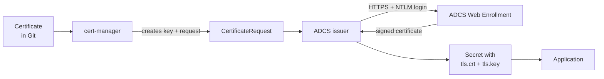

# Certificates on OpenShift with cert-manager and Active Directory Certificate Services

When you are done, any application on the cluster can get a TLS certificate signed by your own
company CA (Active Directory Certificate Services, ADCS) just by adding a small `Certificate` file
to Git. Certificates are renewed automatically before they expire, and nobody has to request
them by hand.

Run every command from the root of the Git repository. Each step explains **what** you do and
**why**, and ends with a **Check**. Do not start the next step until the check passes.

---

## How it works

There are four parts involved:

| Part | What it does |
|---|---|
| **cert-manager** | Watches `Certificate` objects. Creates a private key and a certificate request for each, and renews the certificate before it expires. |
| **ADCS issuer** | A plug-in for cert-manager. It sends the certificate request to ADCS and brings the signed certificate back. |
| **ADCS Web Enrollment** | The ADCS web page (`https://<server>/certsrv`) that the ADCS issuer talks to. |
| **Certificate template** | A setting in ADCS that decides what kind of certificate you get: how long it is valid, what it may be used for. |

What happens when you ask for a certificate:



The private key is created inside the cluster and never leaves it. ADCS only sees the request.

---

## Before you start: what you need from the Active Directory team

Ask the team that runs ADCS for these five things. You cannot finish the guide without them.

| # | What | Why |
|---|---|---|
| 1 | The **Web Enrollment URL**, for example `https://adcs.example.internal/certsrv`. HTTPS must be reachable from the cluster nodes on port 443. | This is where the ADCS issuer sends requests. |
| 2 | A **certificate template** for server certificates. It must allow *Server Authentication*, and the subject and names must be *supplied in the request*. | The template controls what you are allowed to get. Without "supplied in the request", ADCS ignores the names you ask for. |
| 3 | A **service account** in Active Directory with *Read* and *Enroll* rights on that template, and NTLM allowed on the Web Enrollment site. | The ADCS issuer logs in as this account. |
| 4 | The **CA certificates** (root and issuing CA) as PEM files. | So the cluster can trust ADCS's web site and the certificates it signs. A CA certificate is public, so it is safe to keep in Git. |
| 5 | Whether the template needs a **manager approval** in ADCS. | If yes, every request waits until someone approves it in ADCS. Ask for a template without manual approval. |

You also need, in your internal registry and Helm repository (ask whoever runs your mirror):

- the image `docker.io/djkormo/adcs-issuer:2.2.2`
- the Helm chart `adcs-issuer` 2.2.2 from `https://djkormo.github.io/adcs-issuer/`
- the operator `openshift-cert-manager-operator` in your mirrored operator catalog

---

## Step 1: Fill in your values

Change the values to match your environment, then paste the block into your terminal. Every later
step uses these variables.

```bash
export REGISTRY=registry.example.internal                           # internal image registry
export CHART_REPO=https://charts.example.internal/repository/helm   # internal Helm repo
export GIT_REPO=https://git.example.internal/platform/fleet.git
export ADCS_URL=https://adcs.example.internal/certsrv               # from item 1
export ADCS_TEMPLATE=OpenShiftWebServer                             # from item 2
export CA_CHAIN=corporate-ca-chain.pem                              # from item 4: root + issuing CA in one file
```

**Check 1:** the CA file contains certificates and nothing else:

```bash
grep -c 'BEGIN CERTIFICATE' $CA_CHAIN     # 2 or more
grep -c 'PRIVATE KEY' $CA_CHAIN           # must be 0
```

**Check 2:** the service account can log in to Web Enrollment. Run it from a machine in the same
network as the cluster, and type the password when asked:

```bash
curl --ntlm -u 'EXAMPLE\svc-ocp-certs' --cacert $CA_CHAIN -s -o /dev/null -w '%{http_code}\n' $ADCS_URL/
```

`200` is good. `401` means wrong user or password, or NTLM is not enabled. A certificate error
means `$CA_CHAIN` is not the CA of the ADCS web server.

**Check 3:** the operator is in your catalog:

```bash
oc get packagemanifest openshift-cert-manager-operator -n openshift-marketplace \
  -o jsonpath='{.status.defaultChannel}{"\n"}'
```

It prints a channel, for example `stable-v1`.

---

## Step 2: Install cert-manager

**What:** Red Hat's cert-manager operator, installed from the operator catalog through Git.

**Why:** cert-manager does all the work around certificates: keys, requests, renewal. It runs on
every cluster, so its Application goes in `cluster/base/`.

```bash
mkdir -p cluster/applications/cert-manager

cat > cluster/applications/cert-manager/operator.yaml <<'EOF'
apiVersion: v1
kind: Namespace
metadata:
  name: cert-manager-operator
---
apiVersion: operators.coreos.com/v1
kind: OperatorGroup
metadata:
  name: cert-manager-operator
  namespace: cert-manager-operator
spec:
  targetNamespaces:
    - cert-manager-operator
---
apiVersion: operators.coreos.com/v1alpha1
kind: Subscription
metadata:
  name: openshift-cert-manager-operator
  namespace: cert-manager-operator
spec:
  name: openshift-cert-manager-operator
  channel: stable-v1
  source: redhat-operators
  sourceNamespace: openshift-marketplace
  installPlanApproval: Manual
EOF

cat > cluster/applications/cert-manager/kustomization.yaml <<'EOF'
apiVersion: kustomize.config.k8s.io/v1beta1
kind: Kustomization
resources:
  - operator.yaml
EOF

cat > cluster/base/cert-manager.yaml <<EOF
apiVersion: argoproj.io/v1alpha1
kind: Application
metadata:
  name: cert-manager
  namespace: openshift-gitops
  annotations:
    argocd.argoproj.io/sync-wave: "-3"
spec:
  project: default
  source:
    repoURL: $GIT_REPO
    targetRevision: main
    path: cluster/applications/cert-manager
  destination:
    server: https://kubernetes.default.svc
  syncPolicy:
    automated:
      selfHeal: true
    syncOptions:
      - ServerSideApply=true
EOF
```

Add `- cert-manager.yaml` to the list in `cluster/base/kustomization.yaml`. Commit, open a pull
request and merge it.

The installation waits for your approval, because of `installPlanApproval: Manual`. That way
nothing is upgraded without you deciding it:

```bash
oc -n cert-manager-operator get installplan
oc -n cert-manager-operator patch installplan <NAME> --type merge -p '{"spec":{"approved":true}}'
```

**Check:**

```bash
oc -n cert-manager get pods
```

Three pods `Running`: `cert-manager`, `cert-manager-cainjector` and `cert-manager-webhook`.

---

## Step 3: Install the ADCS issuer

**What:** the plug-in that connects cert-manager to ADCS. It is installed with a small chart of
our own that wraps the official chart. In Step 5 we add the connection to ADCS to the same chart.

**Why a chart of our own:** all settings (image from the internal registry, OpenShift mode) live in
one `values.yaml` in Git, and the ADCS connection is released together with the plug-in.

```bash
mkdir -p cluster/applications/adcs-issuer/templates

cat > cluster/applications/adcs-issuer/Chart.yaml <<EOF
apiVersion: v2
name: adcs-issuer
version: 1.0.0
dependencies:
  - name: adcs-issuer
    version: 2.2.2
    repository: $CHART_REPO
EOF

cat > cluster/applications/adcs-issuer/values.yaml <<EOF
adcs-issuer:
  # Creates the security context constraint (SCC) the plug-in needs on OpenShift
  openshift:
    enabled: true
  controllerManager:
    manager:
      image:
        repository: $REGISTRY/djkormo/adcs-issuer
        tag: 2.2.2
        imagePullPolicy: IfNotPresent
  metricsService:
    serviceMonitor:
      enabled: false
EOF

cat > cluster/base/adcs-issuer.yaml <<EOF
apiVersion: argoproj.io/v1alpha1
kind: Application
metadata:
  name: adcs-issuer
  namespace: openshift-gitops
  annotations:
    argocd.argoproj.io/sync-wave: "-2"
spec:
  project: default
  source:
    repoURL: $GIT_REPO
    targetRevision: main
    path: cluster/applications/adcs-issuer
  destination:
    server: https://kubernetes.default.svc
    namespace: adcs-issuer
  syncPolicy:
    automated:
      selfHeal: true
    syncOptions:
      - CreateNamespace=true
      - ServerSideApply=true
EOF

helm dependency update cluster/applications/adcs-issuer
```

Add `- adcs-issuer.yaml` to the list in `cluster/base/kustomization.yaml`.

**Check** before you commit (only your registry may appear):

```bash
helm template adcs-issuer cluster/applications/adcs-issuer -n adcs-issuer | grep 'image:' | sort -u
```

Commit everything **except** the folder `cluster/applications/adcs-issuer/charts/`. Open a pull
request and merge it. If your Helm repo needs a login, add it once in the Argo CD UI:
**Settings → Repositories → Connect Repo**, type **Helm**.

**Check** after the merge:

```bash
oc -n adcs-issuer get pods                  # one pod adcs-issuer-... Running
oc get crd | grep adcs.certmanager           # adcsissuers, adcsrequests, clusteradcsissuers
```

---

## Step 4: Give the ADCS issuer its login

**What:** a Secret with the service account's username and password.

**Why by hand:** a password never goes into Git. The Secret must be in the `adcs-issuer` namespace,
because that is where the plug-in looks for it. (When a secret store such as OpenBao is in place,
this Secret can come from there instead, under the same name.)

```bash
read -rsp 'Password for the ADCS service account: ' PW; echo
oc -n adcs-issuer create secret generic adcs-issuer-credentials \
  --from-literal=username='EXAMPLE\svc-ocp-certs' \
  --from-literal=password="$PW"
unset PW
```

Use the same username format that worked in Check 2 of Step 1 (`DOMAIN\user`).

**Check:**

```bash
oc -n adcs-issuer get secret adcs-issuer-credentials -o jsonpath='{.data}' | jq 'keys'
```

It shows `["password","username"]`.

---

## Step 5: Connect to ADCS

**What:** a `ClusterAdcsIssuer` named `adcs`. It tells the plug-in where ADCS is, which template
to use and which login to use. "Cluster" means every namespace on the cluster can use it.

**Why `caBundle`:** the plug-in talks HTTPS to the Web Enrollment site and must trust its
certificate. `caBundle` is the CA chain from Step 1, base64-encoded.

```bash
cat > cluster/applications/adcs-issuer/templates/clusteradcsissuer.yaml <<EOF
apiVersion: adcs.certmanager.csf.nokia.com/v1
kind: ClusterAdcsIssuer
metadata:
  name: adcs
  annotations:
    # The CRD is installed by the same chart: skip the dry-run on the very first sync
    argocd.argoproj.io/sync-options: SkipDryRunOnMissingResource=true
spec:
  url: $ADCS_URL
  templateName: $ADCS_TEMPLATE
  credentialsRef:
    name: adcs-issuer-credentials
  caBundle: $(base64 -w0 $CA_CHAIN)
  statusCheckInterval: 5m
  retryInterval: 5m
EOF
```

Commit, open a pull request and merge it.

**Check:**

```bash
oc get clusteradcsissuer adcs
oc -n adcs-issuer logs deploy/adcs-issuer --tail=20 | grep -i error
```

The issuer exists, and the log shows no errors. The issuer has no "ready" status of its own: it
only talks to ADCS when a certificate is requested, so the real test is Step 6.

---

## Step 6: Test with a certificate

**What:** ask for one real certificate in a test namespace, look at it, then remove it.

**Why:** this proves the whole chain (cert-manager → plug-in → ADCS → back) before any
application depends on it.

```bash
oc create namespace cert-test
oc apply -f - <<'EOF'
apiVersion: cert-manager.io/v1
kind: Certificate
metadata:
  name: test
  namespace: cert-test
spec:
  secretName: test-tls
  commonName: cert-test.example.internal
  dnsNames:
    - cert-test.example.internal
  privateKey:
    algorithm: RSA
    size: 2048
  issuerRef:
    group: adcs.certmanager.csf.nokia.com
    kind: ClusterAdcsIssuer
    name: adcs
EOF
```

**Check** (it can take a minute):

```bash
oc -n cert-test get certificate test         # READY True
oc -n cert-test get secret test-tls -o jsonpath='{.data.tls\.crt}' | base64 -d \
  | openssl x509 -noout -subject -issuer -dates -ext subjectAltName
```

The issuer is your company CA, and the name `cert-test.example.internal` is in the list.

If `READY` stays `False`, follow the request step by step:

```bash
oc -n cert-test get certificaterequest       # APPROVED True? READY?
oc -n cert-test get adcsrequest              # STATE: pending, ready, errored or rejected
oc -n cert-test describe adcsrequest | tail -5
oc -n adcs-issuer logs deploy/adcs-issuer --tail=30
```

Clean up:

```bash
oc delete namespace cert-test
```

The test certificate stays valid in ADCS until it expires. Ask the ADCS team to revoke it if your
rules require that.

---

## Step 7: Use it in your applications

Every certificate is a small file next to the application in Git. Only `issuerRef` points to ADCS:

```yaml
apiVersion: cert-manager.io/v1
kind: Certificate
metadata:
  name: myapp-tls
  namespace: myapp
spec:
  secretName: myapp-tls            # the Secret the application (or its Route) reads
  dnsNames:
    - myapp.apps.ocp-hub-01.example.internal
  privateKey:
    algorithm: RSA
    size: 2048
  issuerRef:
    group: adcs.certmanager.csf.nokia.com
    kind: ClusterAdcsIssuer
    name: adcs
```

Good to know:

- **Validity comes from the ADCS template**, not from `duration` in the file. cert-manager renews
  automatically when two thirds of the lifetime have passed.
- When another guide asks for an *issuer*, use these three values: group
  `adcs.certmanager.csf.nokia.com`, kind `ClusterAdcsIssuer`, name `adcs`.
- Use RSA keys unless you know the template accepts ECDSA.

---

## Step 8: Make the cluster trust the company CA

**What:** add the CA chain to the cluster's list of trusted CAs.

**Why:** the certificates are now signed by your company CA. Components inside the cluster (the
image registry client, the OAuth server, and anything that reads the injected trust bundle, for
example the OpenBao guide) must trust that CA, or they fail with
`x509: certificate signed by unknown authority`.

First see whether it is already done (common when the cluster was installed with a proxy or a
mirror registry):

```bash
oc get proxy cluster -o jsonpath='{.spec.trustedCA.name}{"\n"}'
```

If a name is printed, check that your CA is in it, and you are done:

```bash
oc -n openshift-config get configmap <NAME> -o jsonpath='{.data.ca-bundle\.crt}' | grep -c 'BEGIN CERTIFICATE'
```

If nothing is printed, add the CA through Git:

```bash
mkdir -p cluster/applications/cluster-trust

oc create configmap company-ca -n openshift-config --from-file=ca-bundle.crt=$CA_CHAIN \
  --dry-run=client -o yaml > cluster/applications/cluster-trust/company-ca.yaml

cat > cluster/applications/cluster-trust/proxy.yaml <<'EOF'
# Only this field is managed from Git; the rest of the cluster-wide proxy object stays as it is
apiVersion: config.openshift.io/v1
kind: Proxy
metadata:
  name: cluster
spec:
  trustedCA:
    name: company-ca
EOF

cat > cluster/applications/cluster-trust/kustomization.yaml <<'EOF'
apiVersion: kustomize.config.k8s.io/v1beta1
kind: Kustomization
resources:
  - company-ca.yaml
  - proxy.yaml
EOF

cat > cluster/base/cluster-trust.yaml <<EOF
apiVersion: argoproj.io/v1alpha1
kind: Application
metadata:
  name: cluster-trust
  namespace: openshift-gitops
  annotations:
    argocd.argoproj.io/sync-wave: "-2"
spec:
  project: default
  source:
    repoURL: $GIT_REPO
    targetRevision: main
    path: cluster/applications/cluster-trust
  destination:
    server: https://kubernetes.default.svc
  syncPolicy:
    automated:
      selfHeal: true
    syncOptions:
      - ServerSideApply=true
EOF
```

Add `- cluster-trust.yaml` to `cluster/base/kustomization.yaml`. Commit, open a pull request and
merge it.

> Changing `trustedCA` makes the nodes reload their trust store. On a running cluster this rolls
> through the nodes one by one, like a small upgrade. Do it in a maintenance window.

**Check** (after the nodes have updated, `oc get mcp` shows `UPDATED True`):

```bash
oc get proxy cluster -o jsonpath='{.spec.trustedCA.name}{"\n"}'     # company-ca
```

---

## If something does not work

| What you see | What it means | What to do |
|---|---|---|
| No `AdcsRequest` is created at all | The plug-in is not running, or the `issuerRef` is wrong | `oc -n adcs-issuer get pods`, and check group, kind and name in `issuerRef` (Step 7) |
| `CertificateRequest` shows `APPROVED` empty | cert-manager has not approved it | The chart gives cert-manager the right to approve ADCS requests. Check that cert-manager runs in the namespace `cert-manager` with the service account `cert-manager`. |
| `AdcsRequest` stays `pending` | ADCS waits for a manager to approve the request, or the plug-in cannot reach ADCS | Read the plug-in log. If ADCS is waiting for approval, ask the ADCS team, or ask them to remove manual approval from the template. |
| `AdcsRequest` is `rejected` or `errored` | ADCS refused the request, or the call failed | Usually the template: it does not allow names in the request, the key size is too small, or the account lacks *Enroll*. The message is in `oc describe adcsrequest`. |
| `401` in the plug-in log | Wrong login | Fix the Secret from Step 4 (username format `DOMAIN\user`). |
| `x509: certificate signed by unknown authority` in the plug-in log | `caBundle` does not contain the CA of the ADCS web server | Ask the ADCS team which CA signed the Web Enrollment site, and add it to `$CA_CHAIN`. |
| A certificate is valid for a shorter or longer time than you asked for | The template decides the validity | Expected. Change the template in ADCS if needed. |
