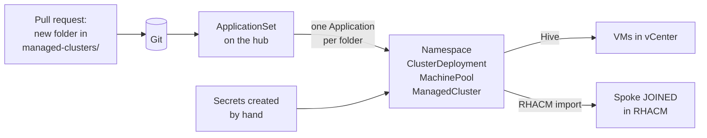

# Proof of concept: child clusters in vCenter from Git, with an existing RHACM hub

This guide takes the part of the lab that creates spoke clusters and runs it on a **real OpenShift
hub that already runs RHACM**: a pull request adds a folder in Git, and the hub creates a new
OpenShift cluster in vCenter and imports it into RHACM, with no clicks in the console.

**In scope:** the spoke's definition in Git, the ApplicationSet that turns it into a cluster, and
what the hub needs to run it.

**Out of scope for the proof of concept:** managing the hub itself from Git (the lab's bootstrap
chart, `base/` and RHACM Subscription). The hub already runs, and stays as it is. See
[Next steps](#10-next-steps).

> **Versions change.** API fields for Hive's vSphere platform differ between RHACM and OpenShift
> versions. Step 3 shows how to read the right fields and values from your own hub. Use its output
> instead of the example values.

## Contents

1. [How it works](#1-how-it-works)
2. [Prerequisites](#2-prerequisites)
3. [Look up values from the hub](#3-look-up-values-from-the-hub)
4. [OpenShift GitOps on the hub](#4-openshift-gitops-on-the-hub)
5. [Release image](#5-release-image)
6. [Secrets, created by hand](#6-secrets-created-by-hand)
7. [The spoke's folder in Git](#7-the-spokes-folder-in-git)
8. [The provisioning ApplicationSet](#8-the-provisioning-applicationset)
9. [Verify and troubleshoot](#9-verify-and-troubleshoot)
10. [Next steps](#10-next-steps)
11. [Appendix: lab file to proof-of-concept file](#11-appendix-lab-file-to-proof-of-concept-file)

---

## 1. How it works

The same flow as the lab. Only the objects in the spoke's folder change: Hive creates VMs in
vCenter instead of Cluster API creating Docker containers.



The files in Git:

```
cluster/overlays/<hub>/
├── spoke-provisioning.yaml          # 8  the ApplicationSet, applied once by hand
├── gitops-provisioning-rbac.yaml    # 4.3  rights for Argo CD, applied once by hand
└── managed-clusters/                # 7  the clusters this hub owns: one folder per cluster
    └── ocp-poc-01/
        ├── kustomization.yaml
        ├── namespace.yaml
        ├── clusterdeployment.yaml
        ├── machinepool.yaml
        └── managedcluster.yaml
```

This is the lab's own layout (`cluster/overlays/k3d-hub-01/`), so the proof of concept can grow
into the full setup later without moving files.

## 2. Prerequisites

| Need | Notes |
|---|---|
| The hub, with RHACM running | `oc -n open-cluster-management get multiclusterhub` shows `Running`. |
| A Git repository the hub can reach | Your internal Git server, with a read-only token for Argo CD. The repository describes your network (VIPs, CIDRs, vCenter), so it must not be public. |
| vCenter access for the installer | A service account with the [vSphere privileges OpenShift needs](https://docs.openshift.com/container-platform/latest/installing/installing_vsphere/ipi/ipi-vsphere-installation-reqs.html), and a VM folder for the spoke. |
| Network from the hub | The installer runs in a pod **on the hub**. The hub needs HTTPS to vCenter **and** to the ESXi hosts (the RHCOS image is uploaded through them), and later to the spoke's API VIP on port 6443. |
| Two free IPs and DNS for the spoke | `api.<spoke>.<baseDomain>` → API VIP, and `*.apps.<spoke>.<baseDomain>` → ingress VIP, in the machine network. |

## 3. Look up values from the hub

None of these commands change anything. The step column in each heading says where the values
are used.

### 3.1 RHACM, Hive and OpenShift GitOps (steps 4, 5, 7)

```bash
oc get clusterversion                                     # OpenShift version of the hub
oc -n open-cluster-management get multiclusterhub -o jsonpath='{.items[0].status.currentVersion}{"\n"}'
oc get multiclusterengine -o jsonpath='{.items[0].status.currentVersion}{"\n"}'

# API versions of every kind this guide uses
oc api-resources | grep -Ei 'clusterdeployment|machinepool|clusterimageset|managedcluster |klusterletaddonconfig'

# Fields: use these instead of the examples, and skip anything marked deprecated
oc explain clusterdeployment.spec.platform.vsphere --recursive
oc explain clusterdeployment.spec.provisioning
oc explain machinepool.spec.platform.vsphere --recursive
oc explain klusterletaddonconfig.spec

oc get clusterimagesets                                   # releases the hub already offers (5)
oc get hiveconfig hive -o yaml                            # proxy and other global Hive settings

# Is OpenShift GitOps installed? (4)
oc get csv -A | grep -i gitops
oc get argocd -A                                          # instance name, normally openshift-gitops
```

The fastest way to see which fields your version wants is the console itself. Start **Create
cluster → VMware vSphere**, fill in the form, and turn on the **YAML** view before you click
Create. It shows the `ClusterDeployment`, `MachinePool`, `ManagedCluster`,
`KlusterletAddonConfig` and install-config that RHACM would create. Copy the field names from
there, then **cancel**: Git creates the cluster, not the console.

### 3.2 vCenter values (steps 6, 7)

The hub runs in the same vCenter, so it already holds most of the values the spoke needs.

```bash
# 1. vCenter and topology (failure domains). Empty on hubs that were upgraded from before 4.13:
#    then use 2 and 3.
oc get infrastructure cluster -o jsonpath='{.spec.platformSpec.vsphere}' | jq

# 2. The hub's own install-config, as it was installed. Passwords are removed from the output.
oc -n kube-system get cm cluster-config-v1 -o jsonpath='{.data.install-config}' \
  | grep -vi -e password -e pullSecret

# 3. Where the hub's machines really are: folder, datastore, resource pool, port group, template
oc -n openshift-machine-api get machinesets \
  -o jsonpath='{range .items[*]}{.metadata.name}{"\n"}{.spec.template.spec.providerSpec.value.workspace}{"\n"}{.spec.template.spec.providerSpec.value.network}{"\n"}{end}'

# 4. The hub's network CIDRs: the spoke's must not overlap them
oc get network.config cluster -o jsonpath='{.spec}' | jq

# 5. The hub's VIPs: the spoke needs two NEW free addresses, never these
oc get infrastructure cluster -o jsonpath='{.status.platformStatus.vsphere}' | jq
```

What to take from the hub, and what must be new for the spoke:

| Spoke field | Where the value comes from | Reuse or new |
|---|---|---|
| `platform.vsphere.vcenters[].server`, `ClusterDeployment` `vCenter` | 1 `vcenters[].server`, or 3 `workspace.server` | Reuse |
| `vcenters[].datacenters`, `topology.datacenter`, `ClusterDeployment` `datacenter` | 1 `failureDomains[].topology.datacenter`, or 3 `workspace.datacenter` | Reuse |
| `topology.computeCluster`, `ClusterDeployment` `cluster` | 1 `topology.computeCluster`, or 2 `platform.vsphere` | Reuse. `ClusterDeployment` takes the last part of the path only. |
| `topology.datastore`, `ClusterDeployment` `defaultDatastore` | 1 `topology.datastore`, or 3 `workspace.datastore` | Reuse, or ask the vSphere team for a separate one. `defaultDatastore` takes the last part only. |
| `topology.networks`, `ClusterDeployment` `network` | 1 `topology.networks`, or 3 `network.devices[].networkName` | Reuse if the spoke lives in the same network. A new port group means new VIPs and a new CIDR. |
| `topology.folder`, `ClusterDeployment` `folder` | 3 `workspace.folder` shows the pattern, e.g. `/dc1/vm/<hub>` | **New**: `/<datacenter>/vm/<spoke>`. Ask the vSphere team to create it, or check that the installer account may create folders. |
| `topology.resourcePool` | 1 or 3 `workspace.resourcePool` | Reuse, if your hub uses one |
| `networking.machineNetwork` | 2 `networking.machineNetwork` | Same CIDR if the spoke uses the same port group |
| `networking.clusterNetwork`, `serviceNetwork` | 4 | Can be the same as the hub's. These are internal to each cluster. |
| `apiVIPs`, `ingressVIPs` | 5 shows the hub's | **New**: two free IPs in the machine network, from the network team |
| `baseDomain` | 2 `baseDomain` | Usually reuse. The spoke becomes `api.<spoke>.<baseDomain>`, so DNS records are **new**. |
| `vsphere-certs` (`.cacert`) | `oc -n openshift-config get cm kube-cloud-config -o jsonpath='{.data.ca-bundle\.pem}'`, or download from `https://<vcenter>/certs/download.zip` | Reuse |
| `vsphere-creds` | The account the hub uses: `oc -n kube-system get secret vsphere-creds -o jsonpath='{.data}' \| jq 'keys'` shows the key names only | Use a separate installer account for spokes if you can, so the hub's account can be rotated on its own |
| `imageDigestSources` (disconnected) | `oc get imagedigestmirrorset -o yaml` | Reuse |
| `sshKey` | 2 `sshKey` | Reuse, or your team's own key |

If a vSphere credential was created in the RHACM console (**Credentials**), it holds the same
values. Print it **without** the password, pull secret and SSH key:

```bash
oc get secret -A -l cluster.open-cluster-management.io/type=vmw
oc -n <namespace> get secret <name> -o json \
  | jq '.data | map_values(@base64d) | del(.password, .pullSecret, .sshPrivatekey)'
```

### 3.3 Pull secret and mirrors (step 6)

```bash
# The hub's own pull secret. In a disconnected environment it also holds the mirror registry login.
oc -n openshift-config extract secret/pull-secret --keys=.dockerconfigjson --to=- > pull-secret.json

# Disconnected: the mirrors the spoke's install-config needs under imageDigestSources
oc get imagedigestmirrorset -o yaml
oc get imagecontentsourcepolicy -o yaml                   # older clusters
```

### 3.4 The install-config schema of the exact release you install (step 6)

`openshift-install explain` shows every field, and comes from the release image itself:

```bash
oc adm release extract --command=openshift-install --to=. \
  quay.io/openshift-release-dev/ocp-release:4.19.10-x86_64   # the releaseImage from step 5
./openshift-install explain installconfig.platform.vsphere
./openshift-install explain installconfig.platform.vsphere.failureDomains
```

`pull-secret.json` and `openshift-install` are only for your workstation. Never commit them.

## 4. OpenShift GitOps on the hub

### 4.1 Install it, if it is not there

If `oc get argocd -A` in step 3.1 shows `openshift-gitops`, skip to 4.2. Otherwise install the
operator once. It creates the Argo CD instance `openshift-gitops` by itself.

```bash
oc apply -f - <<'EOF'
apiVersion: v1
kind: Namespace
metadata:
  name: openshift-gitops-operator
---
apiVersion: operators.coreos.com/v1
kind: OperatorGroup
metadata:
  name: openshift-gitops-operator
  namespace: openshift-gitops-operator
spec:
  upgradeStrategy: Default
---
apiVersion: operators.coreos.com/v1alpha1
kind: Subscription
metadata:
  name: openshift-gitops-operator
  namespace: openshift-gitops-operator
spec:
  name: openshift-gitops-operator
  channel: latest                    # oc get packagemanifest openshift-gitops-operator -n openshift-marketplace
  source: redhat-operators           # your mirrored CatalogSource if disconnected
  sourceNamespace: openshift-marketplace
EOF

oc -n openshift-gitops get pods              # wait until everything is Running
oc -n openshift-gitops get route openshift-gitops-server
```

Log in through the route with your OpenShift account. Members of `cluster-admins` are Argo CD
admins.

### 4.2 Access to the Git repository

Argo CD needs a read-only token for the repository. Create the Secret by hand, never in Git:

```bash
read -rsp 'Git token: ' GIT_TOKEN; echo
oc -n openshift-gitops create secret generic fleet-repo \
  --from-literal=type=git \
  --from-literal=url=https://git.example.internal/platform/fleet.git \
  --from-literal=username=argocd \
  --from-literal=password="$GIT_TOKEN"
unset GIT_TOKEN
oc -n openshift-gitops label secret fleet-repo argocd.argoproj.io/secret-type=repository
```

If the Git server uses a certificate from your internal CA, add the CA in the Argo CD UI:
**Settings → Repository certificates and known hosts → Add TLS certificate**, with the Git
server's host name. Then check that **Settings → Repositories** shows the repository as
`Successful`.

### 4.3 Rights to create clusters

The default Argo CD instance may not create Hive and RHACM objects. Give it exactly those rights,
and **no delete**: Argo CD can create and update a cluster, but it can never remove one. You
delete a cluster deliberately, by hand.

`cluster/overlays/<hub>/gitops-provisioning-rbac.yaml`:

```yaml
# Lets the hub's Argo CD create the objects in managed-clusters/<cluster>/.
# No "delete" anywhere: removing a cluster is always a deliberate manual step.
apiVersion: rbac.authorization.k8s.io/v1
kind: ClusterRole
metadata:
  name: gitops-cluster-provisioning
rules:
  - apiGroups: [""]
    resources: [namespaces]
    verbs: [get, list, watch, create, update, patch]
  - apiGroups: [hive.openshift.io]
    resources: [clusterdeployments, machinepools, clusterimagesets]
    verbs: [get, list, watch, create, update, patch]
  - apiGroups: [cluster.open-cluster-management.io]
    resources: [managedclusters]
    verbs: [get, list, watch, create, update, patch]
  # RHACM only accepts hubAcceptsClient: true from someone allowed to accept clusters
  - apiGroups: [register.open-cluster-management.io]
    resources: [managedclusters/accept]
    verbs: [update]
  - apiGroups: [agent.open-cluster-management.io]
    resources: [klusterletaddonconfigs]
    verbs: [get, list, watch, create, update, patch]
---
apiVersion: rbac.authorization.k8s.io/v1
kind: ClusterRoleBinding
metadata:
  name: gitops-cluster-provisioning
roleRef:
  apiGroup: rbac.authorization.k8s.io
  kind: ClusterRole
  name: gitops-cluster-provisioning
subjects:
  - kind: ServiceAccount
    # Check the name: oc -n openshift-gitops get sa | grep application-controller
    name: openshift-gitops-argocd-application-controller
    namespace: openshift-gitops
```

```bash
oc apply -f cluster/overlays/<hub>/gitops-provisioning-rbac.yaml
```

## 5. Release image

Hive installs the OpenShift release named by a **`ClusterImageSet`**. The lab's equivalent is the
Kubernetes `version` in `controlplane.yaml`.

```bash
oc get clusterimagesets
```

If the release you want is listed, use its name in step 7.3 and go on. If not (common when
disconnected), create one by hand. For the proof of concept it does not have to be in Git:

```bash
oc apply -f - <<'EOF'
apiVersion: hive.openshift.io/v1
kind: ClusterImageSet
metadata:
  name: img4.19.10-x86-64
spec:
  # Disconnected: your mirror registry, by digest
  releaseImage: quay.io/openshift-release-dev/ocp-release:4.19.10-x86_64
EOF
```

## 6. Secrets, created by hand

The lab needed no credentials, because Docker creates the "machines". vCenter does. Until a
secret store and the External Secrets Operator are in place, create these four Secrets **by hand**
in the spoke's namespace on the hub. Do it **before** you merge the pull request in step 7, so
Hive finds them on its first attempt. Argo CD then takes over the namespace from
`namespace.yaml`.

| Secret | Keys | Used by |
|---|---|---|
| `vsphere-creds` | `username`, `password` | Hive: provisioning, MachinePools, deprovisioning |
| `vsphere-certs` | `.cacert` | Hive: trusting vCenter's TLS certificate |
| `pull-secret` | `.dockerconfigjson` | Hive: the installer's pull secret |
| `ocp-poc-01-install-config` | `install-config.yaml` | Hive: the cluster's installation parameters |

The names are the contract with `clusterdeployment.yaml`. Later, `ExternalSecret` objects create
Secrets with **the same names**, and nothing in Git has to change.

First write `install-config.yaml` with the values from step 3.2. It replaces the lab's
`controlplane.yaml` (the control plane) and `cni/kindnet.yaml` (`networkType`). Keep it **outside
the repository**: it contains the vCenter password, like the install-config the RHACM console
generates. A minimal example for vSphere IPI on OpenShift 4.13+:

```yaml
apiVersion: v1
metadata:
  name: ocp-poc-01
baseDomain: example.internal
controlPlane:                         # lab: controlplane.yaml
  name: master
  replicas: 3
  platform:
    vsphere:
      cpus: 4
      coresPerSocket: 2
      memoryMB: 16384
      osDisk:
        diskSizeGB: 120
compute:
  - name: worker
    replicas: 2
networking:
  networkType: OVNKubernetes          # lab: cni/kindnet.yaml
  clusterNetwork:
    - cidr: 10.128.0.0/14
      hostPrefix: 23
  serviceNetwork:
    - 172.30.0.0/16
  machineNetwork:
    - cidr: 10.10.20.0/24
platform:
  vsphere:
    apiVIPs: [10.10.20.10]
    ingressVIPs: [10.10.20.11]
    vcenters:
      - server: vcenter.example.internal
        datacenters: [dc1]
        user: svc-ocp-installer@vsphere.local
        password: <password>
    failureDomains:
      - name: fd1
        region: region1
        zone: zone1
        server: vcenter.example.internal
        topology:
          datacenter: dc1
          computeCluster: /dc1/host/cluster1
          datastore: /dc1/datastore/ds1
          networks: [vm-network-20]
          folder: /dc1/vm/ocp-poc-01
sshKey: ssh-ed25519 AAAA... ops@example.internal
# pullSecret is left out: Hive adds it from pull-secret
```

Then create the namespace and the Secrets:

```bash
oc create namespace ocp-poc-01

# Read the password without echoing it or saving it in the shell history
read -rsp 'vCenter password: ' VC_PASS; echo
oc -n ocp-poc-01 create secret generic vsphere-creds \
  --from-literal=username='svc-ocp-installer@vsphere.local' \
  --from-literal=password="$VC_PASS"
unset VC_PASS

oc -n ocp-poc-01 create secret generic vsphere-certs \
  --from-file=.cacert=vcenter-ca.pem

oc -n ocp-poc-01 create secret generic pull-secret \
  --type=kubernetes.io/dockerconfigjson \
  --from-file=.dockerconfigjson=pull-secret.json

oc -n ocp-poc-01 create secret generic ocp-poc-01-install-config \
  --from-file=install-config.yaml=install-config.yaml
```

Delete the local `install-config.yaml` and `pull-secret.json` afterwards, or keep them in your
password manager. Never commit them.

## 7. The spoke's folder in Git

Everything goes in `cluster/overlays/<hub>/managed-clusters/ocp-poc-01/`, exactly like the lab's
`k3d-spoke-01`. The **namespace name must equal the cluster name**, as in the lab.

> **Check every file against your hub before the first commit.** Hive has changed the
> `platform.vsphere` section between versions, and the fields below may not match yours. Use
> `oc explain` and the console's YAML view from step 3.1, and use their field names where they
> differ.

### 7.1 `namespace.yaml`: same as the lab

```yaml
apiVersion: v1
kind: Namespace
metadata:
  name: ocp-poc-01
```

### 7.2 `clusterdeployment.yaml`: replaces the lab's `cluster.yaml`

The lab's `Cluster` + `DevCluster` become one `ClusterDeployment`. The vSphere fields replace the
`DevCluster`. The annotation is the same as in the lab.

```yaml
apiVersion: hive.openshift.io/v1
kind: ClusterDeployment
metadata:
  name: ocp-poc-01
  namespace: ocp-poc-01
  labels:
    cloud: vSphere
    vendor: OpenShift
  annotations:
    # Never let Argo CD delete a cluster (same as the lab's cluster.yaml)
    argocd.argoproj.io/sync-options: Prune=false,Delete=false
spec:
  clusterName: ocp-poc-01
  baseDomain: example.internal
  # Keep the VMs if this object is ever deleted
  preserveOnDelete: true
  platform:
    vsphere:
      # CHECK against your Hive version (see the box above)
      vCenter: vcenter.example.internal
      datacenter: dc1
      defaultDatastore: ds1
      cluster: cluster1
      network: vm-network-20
      folder: /dc1/vm/ocp-poc-01
      credentialsSecretRef:
        name: vsphere-creds
      certificatesSecretRef:
        name: vsphere-certs
  provisioning:
    installConfigSecretRef:
      name: ocp-poc-01-install-config
    imageSetRef:
      name: img4.19.10-x86-64          # from step 5
  pullSecretRef:
    name: pull-secret
```

### 7.3 `machinepool.yaml`: the worker nodes

The lab spoke has no workers. On OpenShift, Hive manages the workers through a `MachinePool`.
Keep `replicas` the same as `compute` in the install-config.

```yaml
apiVersion: hive.openshift.io/v1
kind: MachinePool
metadata:
  name: ocp-poc-01-worker
  namespace: ocp-poc-01
spec:
  clusterDeploymentRef:
    name: ocp-poc-01
  name: worker
  replicas: 2
  platform:
    vsphere:
      cpus: 4
      coresPerSocket: 2
      memoryMB: 16384
      osDisk:
        diskSizeGB: 120
```

### 7.4 `managedcluster.yaml`: same as the lab, plus add-ons

The `ManagedCluster` is the same API as in the lab. RHACM imports the cluster as soon as Hive has
installed it, so the lab's `import-rbac.yaml` is not needed. The `KlusterletAddonConfig` installs
the RHACM add-ons (policies, search, applications) on the spoke. The console's **Create cluster**
wizard generates it too, so compare its `spec` with the console's YAML view.

```yaml
apiVersion: cluster.open-cluster-management.io/v1
kind: ManagedCluster
metadata:
  name: ocp-poc-01
  labels:
    cloud: vSphere
    vendor: OpenShift
  annotations:
    # Never let Argo CD remove the registration (for a Hive cluster this can tear it down)
    argocd.argoproj.io/sync-options: Prune=false,Delete=false
spec:
  hubAcceptsClient: true
---
apiVersion: agent.open-cluster-management.io/v1
kind: KlusterletAddonConfig
metadata:
  name: ocp-poc-01
  namespace: ocp-poc-01
spec:
  clusterName: ocp-poc-01
  clusterNamespace: ocp-poc-01
  applicationManager:
    enabled: true
  policyController:
    enabled: true
  searchCollector:
    enabled: true
  certPolicyController:
    enabled: true
```

### 7.5 `kustomization.yaml`

The lab's list without `controlplane.yaml`, `cni.yaml`, `import-rbac.yaml` and the
`configMapGenerator`:

```yaml
# Applied to the HUB: how ocp-poc-01 is created and registered.
# The Secrets it uses are created by hand (step 6), not from Git.
apiVersion: kustomize.config.k8s.io/v1beta1
kind: Kustomization
resources:
  - namespace.yaml
  - clusterdeployment.yaml
  - machinepool.yaml
  - managedcluster.yaml
```

Render it before you commit:

```bash
oc kustomize cluster/overlays/<hub>/managed-clusters/ocp-poc-01
```

## 8. The provisioning ApplicationSet

The same file as the lab's `spoke-provisioning.yaml`. Change only the Git URL and the hub name in
the path. The lab's sync wave annotation is left out, because here the file is applied by hand
and not through the app of apps.

`cluster/overlays/<hub>/spoke-provisioning.yaml`:

```yaml
# One Application per folder in this hub's managed-clusters/ inventory.
# New cluster = new folder in a pull request; nothing on the hub needs to change.
apiVersion: argoproj.io/v1alpha1
kind: ApplicationSet
metadata:
  name: spoke-provisioning
  namespace: openshift-gitops
spec:
  goTemplate: true
  goTemplateOptions: ["missingkey=error"]
  generators:
    - git:
        repoURL: https://git.example.internal/platform/fleet.git
        revision: main
        directories:
          - path: cluster/overlays/<hub>/managed-clusters/*
  template:
    metadata:
      name: '{{ .path.basename }}-provisioning'
    spec:
      project: default
      source:
        repoURL: https://git.example.internal/platform/fleet.git
        targetRevision: main
        path: '{{ .path.path }}'
      destination:
        server: https://kubernetes.default.svc
      syncPolicy:
        automated:
          prune: true
          selfHeal: true
        syncOptions:
          - ServerSideApply=true
  syncPolicy:
    # Deleting the ApplicationSet, or a folder, must never delete a running cluster
    preserveResourcesOnDeletion: true
```

Commit and merge the spoke's folder and this file, then apply the ApplicationSet once:

```bash
oc apply -f cluster/overlays/<hub>/spoke-provisioning.yaml
```

From now on, a new cluster is only a new folder under `managed-clusters/`, and nothing on the hub
has to be applied by hand except the cluster's Secrets (step 6).

## 9. Verify and troubleshoot

Installation takes 40–60 minutes.

```bash
oc -n openshift-gitops get applicationset spoke-provisioning
oc -n openshift-gitops get applications ocp-poc-01-provisioning     # Synced
oc -n ocp-poc-01 get clusterdeployment                               # INSTALLED becomes true
oc -n ocp-poc-01 get pods                                            # the *-provision-* pod runs the installer
oc -n ocp-poc-01 logs -f -l hive.openshift.io/job-type=provision -c hive
oc get managedclusters ocp-poc-01                                    # JOINED and AVAILABLE True
```

| Symptom | Likely cause |
|---|---|
| No Application `ocp-poc-01-provisioning` | The ApplicationSet cannot read Git (4.2), or the path in the generator does not match the folder. Check `oc -n openshift-gitops describe applicationset spoke-provisioning`. |
| Application `SyncFailed` with `forbidden` | Argo CD lacks a right (4.3). The message names the resource. Add it to the ClusterRole. |
| `ManagedCluster` rejected, mentions `accept` | The `managedclusters/accept` rule is missing (4.3). |
| ClusterDeployment waits, `ProvisionStopped` or no provision pod | A Secret is missing or has the wrong key (6), or the ClusterImageSet name is wrong (5). `oc -n ocp-poc-01 describe clusterdeployment ocp-poc-01` shows the condition. |
| Provision pod fails early | Missing vSphere privilege, untrusted vCenter certificate (`vsphere-certs`), or no network path from the hub to vCenter or the ESXi hosts. |
| Provision pod fails late (bootstrap, API timeout) | DNS for `api.` / `*.apps.` is missing, or a VIP is already in use. |

Hive stores the admin credentials in the cluster namespace. Treat them as break-glass access:

```bash
oc -n ocp-poc-01 get clusterdeployment ocp-poc-01 \
  -o jsonpath='{.spec.clusterMetadata.adminKubeconfigSecretRef.name}'
```

**Removing the proof-of-concept cluster.** Argo CD cannot do it (no delete right in 4.3, and
`Prune=false,Delete=false`). Remove the folder from Git first, then delete by hand. Because of
`preserveOnDelete: true`, Hive would keep the VMs, so turn it off first if you want them gone:

```bash
oc -n ocp-poc-01 patch clusterdeployment ocp-poc-01 --type merge -p '{"spec":{"preserveOnDelete":false}}'
oc delete managedcluster ocp-poc-01
oc -n ocp-poc-01 delete clusterdeployment ocp-poc-01      # Hive deletes the VMs
```

## 10. Next steps

After the proof of concept, in this order:

- **Hand the spoke to its own Argo CD.** The hub installs OpenShift GitOps and a `root`
  Application on each new spoke. From then on the spoke's own Argo CD owns what runs on it. This
  is the lab's next phase.
- **Secrets from a secret store** (OpenBao or Vault, plus the External Secrets Operator). This
  replaces step 6: `ExternalSecret` objects create the same four Secrets with the same names, so
  `clusterdeployment.yaml` does not change.
- **The hub's own configuration in Git.** What is applied by hand in this guide
  (`gitops-provisioning-rbac.yaml`, `spoke-provisioning.yaml`, ClusterImageSets) moves into the
  lab's app-of-apps pattern: a bootstrap Helm chart with the `root` Application, and the hub
  overlay's `kustomization.yaml`. The RHACM and GitOps Subscriptions that already run can be
  adopted the same way.

## 11. Appendix: lab file to proof-of-concept file

| Lab file | Proof of concept |
|---|---|
| `overlays/k3d-hub-01/spoke-provisioning.yaml` | Same, applied once by hand (8) |
| `managed-clusters/<cluster>/namespace.yaml` | Same (7.1) |
| (none: Docker needs no credentials) | Four Secrets created by hand (6) |
| `managed-clusters/<cluster>/cluster.yaml` | `clusterdeployment.yaml` (7.2) |
| `managed-clusters/<cluster>/controlplane.yaml` | Control plane: install-config (6). Workers: `machinepool.yaml` (7.3) |
| `managed-clusters/<cluster>/cni.yaml` + `cni/kindnet.yaml` | `networkType: OVNKubernetes` in install-config (6) |
| `managed-clusters/<cluster>/managedcluster.yaml` | Same, plus `KlusterletAddonConfig` (7.4) |
| `managed-clusters/<cluster>/import-rbac.yaml` | Not needed: RHACM reads Hive's kubeconfig itself |
| `managed-clusters/<cluster>/kustomization.yaml` | New resource list (7.5) |
| `overlays/k3d-hub-01/capi.yaml` | Not needed: Hive ships with RHACM |
| `applications/ocm-hub/`, `ocm-hub.yaml`, `cluster-info.yaml` | Not needed: RHACM already runs |
| `helm/bootstrap/`, `helm/infra/`, `base/` | Not part of the proof of concept (10) |
| `helm/bootstrap/templates/clusterrolebinding.yaml` | `gitops-provisioning-rbac.yaml`, scoped to Hive and RHACM objects, no delete (4.3) |
