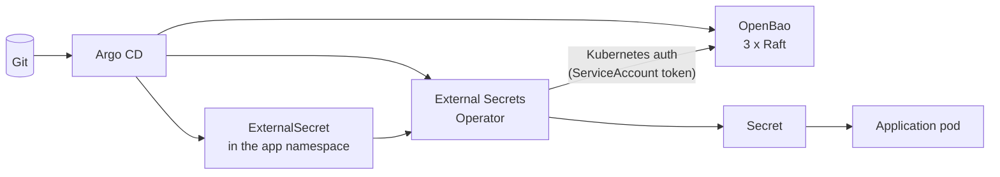

# Secrets on OpenShift: OpenBao + External Secrets Operator

This guide installs a central secret store and connects the cluster to it, the same chain the lab
runs (steps 4 and 5 of the infra platform), on a real OpenShift hub:

- **OpenBao** (open-source Vault) holds every secret. It runs on the hub, installed from a wrapper
  Helm chart that also contains the connection to it (the `ClusterSecretStore`).
- The **External Secrets Operator for Red Hat OpenShift** (OLM) turns `ExternalSecret` objects in
  Git into ordinary Kubernetes Secrets, with the values fetched from OpenBao.
- **Applications** keep using normal Secrets. Only the way the Secret is created changes.

Charts and images come from an **internal registry**, set once in the chart's global values.

It fits the repository layout of the lab and of
[openshift-implementation.md](openshift-implementation.md): manifests in `cluster/applications/`,
Argo CD Applications in `cluster/base/` (every cluster) or `cluster/overlays/<hub>/` (hub only).
Step 11 replaces the manual Secrets in step 6 of that guide.

> **Versions change.** Check operator channels and API fields on your cluster before you commit
> (`oc get packagemanifests -n openshift-marketplace`, `oc explain <kind>.spec`). Section 3 lists
> the commands.

## Contents

1. [How it works](#1-how-it-works)
2. [Prerequisites](#2-prerequisites)
3. [Look up values from the cluster](#3-look-up-values-from-the-cluster)
4. [Files in Git](#4-files-in-git)
5. [External Secrets Operator (OLM)](#5-external-secrets-operator-olm)
6. [OpenBao wrapper chart](#6-openbao-wrapper-chart)
7. [Initialize and unseal](#7-initialize-and-unseal)
8. [Configure OpenBao](#8-configure-openbao)
9. [Verify the chain](#9-verify-the-chain)
10. [Secrets for applications](#10-secrets-for-applications)
11. [Replace the manual Secrets of the cluster provisioning guide](#11-replace-the-manual-secrets-of-the-cluster-provisioning-guide)
12. [Operations](#12-operations)
13. [Troubleshooting](#13-troubleshooting)
14. [Lab versus production](#14-lab-versus-production)

---

## 1. How it works



1. An `ExternalSecret` in Git says: "Secret `db-credentials` in this namespace gets its values
   from `clusters/<cluster>/<namespace>/db` in OpenBao." The value itself is never in Git.
2. ESO logs in to OpenBao with a short-lived ServiceAccount token (Kubernetes auth). OpenBao
   checks the token against the cluster's API and gives ESO read access to that cluster's paths
   only.
3. ESO writes the Secret and refreshes it on an interval. A change in OpenBao reaches the cluster
   without a commit.

| Component | Installed by | Where | Why this way |
|---|---|---|---|
| External Secrets Operator | OLM, `redhat-operators` | Every cluster (`base`) | Red Hat supported operator |
| OpenBao | Helm (wrapper chart) | Hub only (hub overlay) | No Red Hat operator exists; Vault/OpenBao are installed with Helm on OpenShift too |
| `ClusterSecretStore` and its ServiceAccount | The same wrapper chart (`templates/`) | Hub | The connection belongs to the store it connects to |
| TLS certificate for OpenBao | The same wrapper chart, issued by cert-manager | Hub | Corporate CA |

## 2. Prerequisites

| Need | Check |
|---|---|
| OpenShift GitOps with the app-of-apps from the lab | `oc -n openshift-gitops get applications` |
| cert-manager Operator for Red Hat OpenShift and a `ClusterIssuer` for the corporate CA | `oc get clusterissuer` |
| The corporate root CA certificate (PEM) | Public, may be committed |
| A default StorageClass with block or file storage | `oc get storageclass` |
| Internal registry holding the OpenBao image | Section 3 |
| Internal Helm repository (or OCI registry) holding the OpenBao chart | Section 6.1 |
| The operator catalog with `openshift-external-secrets-operator` (mirrored if disconnected) | Section 3 |
| People who will hold the unseal keys (5 people, 3 needed) | Section 7 |

## 3. Look up values from the cluster

None of these commands change anything.

```bash
# Cluster name and the apps domain (for the OpenBao Route host)
oc get infrastructure cluster -o jsonpath='{.status.infrastructureName}{"\n"}'
oc get ingresses.config cluster -o jsonpath='{.spec.domain}{"\n"}'

# External Secrets Operator: package, channels, catalog
oc get packagemanifest openshift-external-secrets-operator -n openshift-marketplace \
  -o jsonpath='catalog: {.status.catalogSource}{"\n"}default: {.status.defaultChannel}{"\n"}{range .status.channels[*]}{.name}  {.currentCSV}{"\n"}{end}'

# cert-manager issuer for the OpenBao certificate
oc get clusterissuer

# StorageClass for the Raft volumes
oc get storageclass

# Is the corporate CA already trusted cluster-wide? (then caBundle.pem can stay empty, see 6.3)
oc get proxy cluster -o jsonpath='{.spec.trustedCA.name}{"\n"}'

# The OpenBao image in the internal registry (use the tag you mirrored)
oc image info registry.example.internal/openbao/openbao:2.7.0 --filter-by-os=linux/amd64

# Do namespaces get a default-deny NetworkPolicy from the project template?
oc get networkpolicy -A | head
```

Pick the cluster name you will use in OpenBao paths and role names (for example `ocp-hub-01`).
It must be the same everywhere in this guide.

## 4. Files in Git

```
cluster/
├── base/
│   ├── kustomization.yaml                 # + external-secrets.yaml
│   └── external-secrets.yaml              # 5   wave -1, every cluster
├── applications/
│   ├── external-secrets-operator/         # 5
│   │   ├── kustomization.yaml
│   │   ├── namespace.yaml
│   │   ├── operatorgroup.yaml
│   │   ├── subscription.yaml
│   │   └── externalsecretsconfig.yaml
│   └── openbao/                           # 6   wrapper Helm chart
│       ├── Chart.yaml
│       ├── Chart.lock
│       ├── values.yaml                    #     global values: registry, TLS, HA
│       └── templates/
│           ├── ca-bundle.yaml
│           ├── certificate.yaml
│           └── secretstore.yaml           #     ServiceAccount + ClusterSecretStore
└── overlays/
    └── <hub>/
        ├── kustomization.yaml             # + openbao.yaml
        └── openbao.yaml                   # 6   wave 1, hub only: cluster-specific values
scripts/
└── openbao-configure.sh                   # 8   KV, Kubernetes auth, policies, audit
```

## 5. External Secrets Operator (OLM)

The operator installs in `external-secrets-operator` (AllNamespaces only). The operand, the
actual ESO controller, runs in `external-secrets` and is created by the `ExternalSecretsConfig`
named `cluster`.

**Network policies.** The operator isolates its pods with a deny-all NetworkPolicy and only
allows the API server and DNS. Without an extra egress rule, ESO **cannot reach OpenBao**. The rule
goes in `ExternalSecretsConfig`, and the operator creates it as `eso-user-<name>`.

`cluster/applications/external-secrets-operator/namespace.yaml`:

```yaml
apiVersion: v1
kind: Namespace
metadata:
  name: external-secrets-operator
```

`operatorgroup.yaml` (no `targetNamespaces`: AllNamespaces):

```yaml
apiVersion: operators.coreos.com/v1
kind: OperatorGroup
metadata:
  name: external-secrets-operator
  namespace: external-secrets-operator
spec: {}
```

`subscription.yaml`:

```yaml
apiVersion: operators.coreos.com/v1alpha1
kind: Subscription
metadata:
  name: openshift-external-secrets-operator
  namespace: external-secrets-operator
spec:
  name: openshift-external-secrets-operator
  channel: stable-v1                 # from section 3
  source: redhat-operators           # your mirrored CatalogSource if disconnected
  sourceNamespace: openshift-marketplace
  installPlanApproval: Manual        # upgrades are deliberate: approve the InstallPlan
```

`externalsecretsconfig.yaml`:

```yaml
# The ESO operand. The CRD comes with the operator, so skip the dry-run on the first sync.
apiVersion: operator.openshift.io/v1alpha1
kind: ExternalSecretsConfig
metadata:
  name: cluster                      # singleton: must be "cluster"
  annotations:
    argocd.argoproj.io/sync-wave: "1"
    argocd.argoproj.io/sync-options: SkipDryRunOnMissingResource=true
spec:
  controllerConfig:
    networkPolicies:
      # Let the ESO controller reach OpenBao (in-cluster, port 8200)
      - name: allow-openbao
        componentName: ExternalSecretsCoreController
        egress:
          - to:
              - namespaceSelector:
                  matchLabels:
                    kubernetes.io/metadata.name: openbao
            ports:
              - protocol: TCP
                port: 8200
```

`kustomization.yaml` lists the four files.

`cluster/base/external-secrets.yaml`:

```yaml
# External Secrets Operator on every cluster (Red Hat operator, OLM).
apiVersion: argoproj.io/v1alpha1
kind: Application
metadata:
  name: external-secrets
  namespace: openshift-gitops
  annotations:
    # After cert-manager, before anything that consumes secrets
    argocd.argoproj.io/sync-wave: "-1"
spec:
  project: default
  source:
    repoURL: https://git.example.internal/platform/fleet.git
    targetRevision: main
    path: cluster/applications/external-secrets-operator
  destination:
    server: https://kubernetes.default.svc
  syncPolicy:
    automated:
      prune: false
      selfHeal: true
    syncOptions:
      - ServerSideApply=true
    # ExternalSecretsConfig waits for its CRD, which OLM installs
    retry:
      limit: 10
      backoff:
        duration: 15s
        factor: 2
        maxDuration: 3m
```

Add `external-secrets.yaml` to `cluster/base/kustomization.yaml`. After the merge, approve the
first InstallPlan and check:

```bash
oc -n external-secrets-operator get installplan
oc -n external-secrets-operator patch installplan <name> --type merge -p '{"spec":{"approved":true}}'
oc -n external-secrets-operator get csv                       # Succeeded
oc get externalsecretsconfig cluster -o jsonpath='{range .status.conditions[*]}{.type}={.status} {.message}{"\n"}{end}'
oc -n external-secrets get pods,networkpolicy                 # controller, webhook, cert-controller; eso-user-allow-openbao
oc api-resources --api-group=external-secrets.io | grep -E 'clustersecretstores|externalsecrets '   # v1
```

## 6. OpenBao wrapper chart

A **wrapper chart** is your own small chart that depends on the upstream chart. It gives you:

- one `values.yaml` for the whole installation, with the internal registry set once,
- your own `templates/` next to the upstream chart: certificate, CA bundle and the
  `ClusterSecretStore`, released and versioned together with OpenBao.

Upstream values go under the key `openbao:` (the dependency's name). Values under `global:` are
shared: the upstream chart reads `global.openshift`, `global.tlsDisable` and
`global.imagePullSecrets` from there.

### 6.1 Mirror the chart and the image

```bash
# On a machine with internet access (or through your mirror process)
helm pull openbao --repo https://openbao.github.io/openbao-helm --version 0.30.0
skopeo copy docker://quay.io/openbao/openbao:2.7.0 docker://registry.example.internal/openbao/openbao:2.7.0

# Publish the chart internally: a Helm repository (e.g. Nexus/Artifactory) ...
curl -u "$USER" --upload-file openbao-0.30.0.tgz https://charts.example.internal/repository/helm/
# ... or an OCI registry
helm push openbao-0.30.0.tgz oci://registry.example.internal/charts
```

Argo CD must be able to read the internal chart repository. Register it once (a Secret, never in
Git), the same way as the Git repository in the cluster provisioning guide:

```bash
read -rsp 'Chart repo password: ' PW; echo
oc -n openshift-gitops create secret generic internal-charts \
  --from-literal=type=helm \
  --from-literal=name=internal-charts \
  --from-literal=url=https://charts.example.internal/repository/helm \
  --from-literal=username=argocd \
  --from-literal=password="$PW"
unset PW
oc -n openshift-gitops label secret internal-charts argocd.argoproj.io/secret-type=repository
```

For an OCI registry, use `url=registry.example.internal/charts` and add
`--from-literal=enableOCI=true`.

### 6.2 `Chart.yaml`

`cluster/applications/openbao/Chart.yaml`:

```yaml
apiVersion: v2
name: openbao
description: OpenBao for the fleet, plus the ESO connection (ClusterSecretStore) to it
type: application
version: 1.0.0
dependencies:
  - name: openbao
    version: 0.30.0
    # Internal mirror of https://openbao.github.io/openbao-helm
    repository: https://charts.example.internal/repository/helm
    # OCI instead: repository: oci://registry.example.internal/charts
```

Lock the dependency and commit the lock file. Argo CD downloads the dependency on every render:

```bash
cd cluster/applications/openbao
helm dependency update         # writes Chart.lock and charts/openbao-0.30.0.tgz
cd -
```

Commit `Chart.lock`. Add `cluster/applications/*/charts/` to `.gitignore`, unless your policy is
to vendor the chart in Git. Vendoring (committing `charts/openbao-0.30.0.tgz`) also works, and
then Argo CD does not need access to the chart repository.

### 6.3 `values.yaml`: the global values

`cluster/applications/openbao/values.yaml`. Everything that is the same on every hub is here.
Cluster-specific values (cluster name, Route host) come from the Application in 6.5.

```yaml
# ---------------------------------------------------------------------------
# Global: read by this chart's templates AND by the upstream openbao chart
# ---------------------------------------------------------------------------
global:
  openshift: true              # upstream: Route support, no fixed UIDs (restricted-v2 SCC)
  tlsDisable: false            # upstream: TLS end-to-end
  imagePullSecrets: []         # upstream: e.g. [{name: internal-registry}] if the registry needs a login
  # The internal registry, set ONCE. The &anchor is reused below for every image.
  imageRegistry: &imageRegistry registry.example.internal
  clusterName: ""              # set per cluster in the Application (role eso-<clusterName>)

# Corporate root CA (PEM, public). Used by OpenBao for Raft TLS and by ESO to trust OpenBao.
# Empty: the chart asks OpenShift to inject the cluster's trusted CA bundle instead, which
# contains the corporate CA only if it is configured in proxy/cluster (see section 3).
caBundle:
  pem: ""
  # pem: |
  #   -----BEGIN CERTIFICATE-----
  #   ...
  #   -----END CERTIFICATE-----

# Certificate for the OpenBao API, UI and Raft traffic
tls:
  issuerRef:
    kind: ClusterIssuer
    name: corporate-ca         # from section 3

# ESO connection, rendered by templates/secretstore.yaml
secretStore:
  enabled: true
  name: openbao
  authMountPath: kubernetes
  serviceAccountName: eso-auth
  # Only namespaces with this label may use the store (opt-in, section 10.2)
  namespaceLabel: platform.example.internal/openbao-secrets

# ---------------------------------------------------------------------------
# Upstream chart (dependency "openbao")
# ---------------------------------------------------------------------------
openbao:
  # Secrets reach workloads through ESO, not through sidecars or CSI
  injector:
    enabled: false
  csi:
    enabled: false

  server:
    image:
      registry: *imageRegistry
      repository: openbao/openbao
      tag: "2.7.0"             # pin; must exist in the internal registry

    # OpenShift Route, TLS passthrough: OpenBao terminates TLS itself
    route:
      enabled: true
      activeService: true      # always the Raft leader
      host: ""                 # set per cluster in the Application
      tls:
        termination: passthrough

    # "Ready" also while sealed: unsealing is manual, and Argo CD must never wait on it
    readinessProbe:
      enabled: true
      path: /v1/sys/health?standbyok=true&sealedcode=204&uninitcode=204

    resources:
      requests:
        cpu: 250m
        memory: 256Mi
      limits:
        memory: 1Gi

    volumes:
      - name: openbao-tls
        secret:
          secretName: openbao-tls
      - name: openbao-ca
        configMap:
          name: openbao-ca
    volumeMounts:
      - name: openbao-tls
        mountPath: /openbao/userconfig/openbao-tls
        readOnly: true
      - name: openbao-ca
        mountPath: /openbao/userconfig/openbao-ca
        readOnly: true
    extraEnvironmentVars:
      # The bao CLI inside the pods trusts the corporate CA
      BAO_CACERT: /openbao/userconfig/openbao-ca/ca-bundle.crt

    dataStorage:
      enabled: true
      size: 10Gi
      # storageClass: <from section 3, if not the default>

    # Integrated storage (Raft): 3 replicas, spread by the chart's default anti-affinity
    ha:
      enabled: true
      replicas: 3
      raft:
        enabled: true
        setNodeId: true
        config: |
          ui = true

          listener "tcp" {
            address         = "[::]:8200"
            cluster_address = "[::]:8201"
            tls_cert_file   = "/openbao/userconfig/openbao-tls/tls.crt"
            tls_key_file    = "/openbao/userconfig/openbao-tls/tls.key"
          }

          storage "raft" {
            path = "/openbao/data"
            retry_join {
              leader_api_addr     = "https://openbao-0.openbao-internal:8200"
              leader_ca_cert_file = "/openbao/userconfig/openbao-ca/ca-bundle.crt"
            }
            retry_join {
              leader_api_addr     = "https://openbao-1.openbao-internal:8200"
              leader_ca_cert_file = "/openbao/userconfig/openbao-ca/ca-bundle.crt"
            }
            retry_join {
              leader_api_addr     = "https://openbao-2.openbao-internal:8200"
              leader_ca_cert_file = "/openbao/userconfig/openbao-ca/ca-bundle.crt"
            }
          }

          service_registration "kubernetes" {}

  ui:
    enabled: true
```

Why the YAML anchor: Helm cannot reference one value from another, and the upstream chart has no
global registry key. `&imageRegistry` / `*imageRegistry` makes the registry a single line to
change. Keep the registry in this file (not in the Application): an anchor is resolved when the
file is read, so overriding `global.imageRegistry` elsewhere would not reach the image.

### 6.4 `templates/`

`cluster/applications/openbao/templates/ca-bundle.yaml`:

```yaml
# The CA that OpenBao (Raft peers) and ESO use to trust OpenBao's certificate.
# Either the PEM from values.yaml, or the cluster's trusted bundle injected by OpenShift.
apiVersion: v1
kind: ConfigMap
metadata:
  name: openbao-ca
  namespace: {{ .Release.Namespace }}
  {{- if not .Values.caBundle.pem }}
  labels:
    config.openshift.io/inject-trusted-cabundle: "true"
  {{- end }}
{{- if .Values.caBundle.pem }}
data:
  ca-bundle.crt: |
    {{- .Values.caBundle.pem | nindent 4 }}
{{- end }}
```

`templates/certificate.yaml`:

```yaml
# TLS for the OpenBao API, UI (Route, passthrough) and Raft peers, from the corporate CA.
{{- $ns := .Release.Namespace }}
apiVersion: cert-manager.io/v1
kind: Certificate
metadata:
  name: openbao-tls
  namespace: {{ $ns }}
spec:
  secretName: openbao-tls
  dnsNames:
    - openbao
    - openbao.{{ $ns }}.svc
    - openbao.{{ $ns }}.svc.cluster.local
    - openbao-active.{{ $ns }}.svc
    - openbao-active.{{ $ns }}.svc.cluster.local
    # Raft peers: openbao-0.openbao-internal, ...
    - "*.openbao-internal"
    - "*.openbao-internal.{{ $ns }}.svc"
    - "*.openbao-internal.{{ $ns }}.svc.cluster.local"
    - {{ required "openbao.server.route.host is required" .Values.openbao.server.route.host }}
  ipAddresses:
    - 127.0.0.1                # the bao CLI inside the pods
  duration: 2160h
  renewBefore: 720h
  issuerRef:
    group: cert-manager.io
    kind: {{ .Values.tls.issuerRef.kind }}
    name: {{ .Values.tls.issuerRef.name }}
```

If the corporate CA does not issue wildcard names, replace the three `*.openbao-internal` lines
with `openbao-0.openbao-internal`, `openbao-1.openbao-internal` and `openbao-2.openbao-internal`.

`templates/secretstore.yaml`:

```yaml
# The ESO connection to this OpenBao: a ServiceAccount to log in with, and a
# ClusterSecretStore that opted-in namespaces use.
{{- if .Values.secretStore.enabled }}
{{- $cluster := required "global.clusterName is required" .Values.global.clusterName }}
apiVersion: v1
kind: ServiceAccount
metadata:
  name: {{ .Values.secretStore.serviceAccountName }}
  namespace: {{ .Release.Namespace }}
---
apiVersion: external-secrets.io/v1
kind: ClusterSecretStore
metadata:
  name: {{ .Values.secretStore.name }}
  annotations:
    # The CRD comes from the ESO operator (wave -1); skip the dry-run if it is not there yet
    argocd.argoproj.io/sync-options: SkipDryRunOnMissingResource=true
spec:
  # Only namespaces that opted in may use this store
  conditions:
    - namespaceSelector:
        matchLabels:
          {{ .Values.secretStore.namespaceLabel }}: "true"
  provider:
    vault:
      server: https://openbao-active.{{ .Release.Namespace }}.svc:8200
      path: secret
      version: v2
      caProvider:
        type: ConfigMap
        name: openbao-ca
        namespace: {{ .Release.Namespace }}
        key: ca-bundle.crt
      auth:
        kubernetes:
          mountPath: {{ .Values.secretStore.authMountPath }}
          role: eso-{{ $cluster }}
          serviceAccountRef:
            name: {{ .Values.secretStore.serviceAccountName }}
            namespace: {{ .Release.Namespace }}
{{- end }}
```

### 6.5 The Application (hub overlay)

`cluster/overlays/<hub>/openbao.yaml`. The Application holds only what is specific to this hub:

```yaml
# Hub only: OpenBao, the one secret store for the fleet, and the ESO connection to it.
# Chart: cluster/applications/openbao (wrapper around the upstream openbao chart).
apiVersion: argoproj.io/v1alpha1
kind: Application
metadata:
  name: openbao
  namespace: openshift-gitops
  annotations:
    # After cert-manager and the External Secrets Operator (-1)
    argocd.argoproj.io/sync-wave: "1"
spec:
  project: default
  source:
    repoURL: https://git.example.internal/platform/fleet.git
    targetRevision: main
    path: cluster/applications/openbao
    helm:
      releaseName: openbao
      # Cluster-specific values; everything else is in the chart's values.yaml
      valuesObject:
        global:
          clusterName: ocp-hub-01
        openbao:
          server:
            route:
              host: openbao.apps.ocp-hub-01.example.internal
  destination:
    server: https://kubernetes.default.svc
    namespace: openbao
  syncPolicy:
    automated:
      prune: false             # never prune anything of the secret store automatically
      selfHeal: true
    syncOptions:
      - CreateNamespace=true
      - ServerSideApply=true
  # The Raft StatefulSet's volumeClaimTemplates are defaulted by the API server
  ignoreDifferences:
    - group: apps
      kind: StatefulSet
      jqPathExpressions:
        - .spec.volumeClaimTemplates[]?.apiVersion
        - .spec.volumeClaimTemplates[]?.kind
```

Add `openbao.yaml` to `cluster/overlays/<hub>/kustomization.yaml`.

**Render before you commit.** All images must point at the internal registry:

```bash
cd cluster/applications/openbao
helm dependency build
helm template openbao . -n openbao \
  --set global.clusterName=ocp-hub-01 \
  --set openbao.server.route.host=openbao.apps.ocp-hub-01.example.internal \
  > /tmp/openbao-rendered.yaml
grep -E '^\s+image:' /tmp/openbao-rendered.yaml | sort -u      # only registry.example.internal/...
grep -E '^kind:' /tmp/openbao-rendered.yaml | sort | uniq -c    # StatefulSet, Route, Certificate, ClusterSecretStore, ...
cd -
```

**If namespaces get a default-deny NetworkPolicy** (section 3), OpenBao also needs ingress rules:
from `external-secrets` (ESO), from `openshift-ingress` (the Route) and between its own pods
(Raft). Add them as a `templates/networkpolicy.yaml`.

After the merge:

```bash
oc -n openbao get certificate,pods,pvc,route
oc -n openbao exec openbao-0 -- bao status        # Initialized false, Sealed true: expected
oc get clustersecretstore openbao                  # not Valid yet: OpenBao is not configured (section 8)
```

## 7. Initialize and unseal

`init` creates the master key and splits it into **5 unseal keys**; any **3** unlock OpenBao
(Shamir's secret sharing). It also returns a **root token**. In production:

- Give each unseal key to a different person. Nobody holds three.
- The root token is only used for the first configuration (section 8), then revoked.
- Never paste the output into a terminal log, ticket or chat, and never commit it.

Run init on the first pod only, with the output going straight to a protected file:

```bash
umask 077
oc -n openbao exec openbao-0 -- bao operator init -key-shares=5 -key-threshold=3 -format=json > ~/openbao-init.json
jq '{shares: (.unseal_keys_b64 | length), threshold: .unseal_threshold}' ~/openbao-init.json
```

Distribute the keys and the root token to their holders (password manager), then remove the
file when the configuration in section 8 is done.

**Unseal every pod.** Each Raft member is unsealed on its own. `openbao-1` and `openbao-2` join
the cluster through `retry_join` first, then need the same 3 keys. The key travels through
stdin (`key=-`) and never appears in a process list:

```bash
for pod in openbao-0 openbao-1 openbao-2; do
  for i in 0 1 2; do
    jq -j ".unseal_keys_b64[$i]" ~/openbao-init.json \
      | oc -n openbao exec -i "$pod" -- bao write -format=json sys/unseal key=- \
      | jq -c --arg pod "$pod" '{pod: $pod, sealed, progress}'
  done
done
```

When the key holders unseal instead (the normal case after a restart), each runs the same
command with only their own key:

```bash
read -rsp 'Unseal key: ' K; echo
printf '%s' "$K" | oc -n openbao exec -i openbao-0 -- bao write -format=json sys/unseal key=- | jq -c '{sealed, progress}'
unset K
```

Check that all three members are unsealed and in one Raft cluster:

```bash
for pod in openbao-0 openbao-1 openbao-2; do
  oc -n openbao exec "$pod" -- bao status -format=json | jq -c --arg pod "$pod" '{pod: $pod, sealed, ha_mode: .ha_mode}'
done
jq -r .root_token ~/openbao-init.json | oc -n openbao exec -i openbao-0 -- sh -c \
  'read -r BAO_TOKEN; export BAO_TOKEN; bao operator raft list-peers'
```

Expect `sealed: false` everywhere, one `active` and two `standby`, and three voters in the peer
list.

## 8. Configure OpenBao

The configuration is code: an idempotent script in the repository, with no secrets in it. The
token is read from stdin inside the pod. It is never an argument and never in kubectl's
environment.

| What | Why |
|---|---|
| Audit log to stdout | Every request is logged, and OpenShift logging collects it. Required in a classified environment. |
| KV v2 at `secret/` | Versioned secrets |
| Kubernetes auth at `kubernetes/` | ESO logs in with a ServiceAccount token, and OpenBao validates it with the TokenReview API. There are no static passwords. |
| Policy and role `eso-<cluster>` | ESO on this cluster may **only read** `shared/*` and `clusters/<cluster>/*` |
| Policy `admin` and a human login | So that the root token can be revoked. Production: OIDC against the corporate IdP. userpass is the fallback. |

`scripts/openbao-configure.sh`:

```bash
#!/usr/bin/env bash
# Configures OpenBao for the External Secrets Operator: audit log, KV v2, Kubernetes auth,
# per-cluster policy and role, admin policy. Idempotent: safe to re-run.
#
# Usage:
#   export BAO_TOKEN=...                 # an admin token (or the root token, first run only)
#   CLUSTER=ocp-hub-01 scripts/openbao-configure.sh
set -euo pipefail

CLUSTER="${CLUSTER:?set CLUSTER, e.g. CLUSTER=ocp-hub-01}"
NAMESPACE="${NAMESPACE:-openbao}"
ESO_SA="${ESO_SA:-eso-auth}"
: "${BAO_TOKEN:?export BAO_TOKEN first}"

# Line 1: token. Line 2: cluster name. Line 3: ESO service account. The rest: the script.
{
  printf '%s\n%s\n%s\n' "$BAO_TOKEN" "$CLUSTER" "$ESO_SA"
  cat <<'SCRIPT'
set -eu
enabled() { bao "$1" list -format=json | grep -q "\"$2/\""; }

# Audit log to stdout (collected by OpenShift logging)
enabled audit stdout || bao audit enable -path=stdout file file_path=stdout

# KV version 2 at secret/
enabled secrets secret || bao secrets enable -path=secret -version=2 kv

# Kubernetes auth for this cluster (the chart grants OpenBao system:auth-delegator)
enabled auth kubernetes || bao auth enable kubernetes
bao write auth/kubernetes/config kubernetes_host=https://kubernetes.default.svc

# ESO on this cluster: read-only, shared secrets and this cluster's own paths
printf '%s\n' \
  'path "secret/data/shared/*"                   { capabilities = ["read"] }' \
  'path "secret/metadata/shared/*"               { capabilities = ["read", "list"] }' \
  "path \"secret/data/clusters/${CLUSTER}/*\"     { capabilities = [\"read\"] }" \
  "path \"secret/metadata/clusters/${CLUSTER}/*\" { capabilities = [\"read\", \"list\"] }" \
  | bao policy write "eso-${CLUSTER}" -
bao write "auth/kubernetes/role/eso-${CLUSTER}" \
  bound_service_account_names="${ESO_SA}" \
  bound_service_account_namespaces=openbao \
  token_policies="eso-${CLUSTER}" \
  token_ttl=1h

# Human administrators (production: bind this policy to an OIDC group instead)
printf '%s\n' 'path "*" { capabilities = ["create", "read", "update", "patch", "delete", "list", "sudo"] }' \
  | bao policy write admin -
enabled auth userpass || bao auth enable userpass

echo "OpenBao configured for ${CLUSTER}"
SCRIPT
} | oc -n "$NAMESPACE" exec -i openbao-0 -- sh -c \
  'read -r BAO_TOKEN; read -r CLUSTER; read -r ESO_SA; export BAO_TOKEN CLUSTER ESO_SA; exec sh -s'
```

If you change the ServiceAccount's namespace or name in `values.yaml`, change
`bound_service_account_namespaces` and `ESO_SA` to match.

**First run, with the root token:**

```bash
chmod +x scripts/openbao-configure.sh
export BAO_TOKEN="$(jq -r .root_token ~/openbao-init.json)"
CLUSTER=ocp-hub-01 scripts/openbao-configure.sh
```

**Create your admin login, then revoke root.** Do this in the same session. userpass is shown
here. With OIDC, bind `admin` to your admin group instead.

```bash
read -rsp 'New OpenBao password for your admin user: ' P; echo
{ printf '%s\n' "$BAO_TOKEN"; printf '%s' "$P"; } | oc -n openbao exec -i openbao-0 -- sh -c \
  "read -r BAO_TOKEN; export BAO_TOKEN; bao write auth/userpass/users/$USER policies=admin token_ttl=8h password=-"

# Log in as yourself through the Route: expect ["admin","default"]
export BAO_TOKEN="$(jq -n --arg p "$P" '{password: $p}' \
  | curl -s -X POST --data @- "https://openbao.apps.ocp-hub-01.example.internal/v1/auth/userpass/login/$USER" \
  | jq -r .auth.client_token)"
unset P

# Revoke the root token and prove it is dead
jq -r .root_token ~/openbao-init.json | oc -n openbao exec -i openbao-0 -- sh -c \
  'read -r BAO_TOKEN; export BAO_TOKEN; bao token revoke -self'
{ printf 'X-Vault-Token: '; jq -r .root_token ~/openbao-init.json; } \
  | curl -s -H @- https://openbao.apps.ocp-hub-01.example.internal/v1/auth/token/lookup-self | jq -c .errors
```

The last command must print `["permission denied"]`. Now remove `~/openbao-init.json`. The unseal
keys are with their holders. A new root token can be created in an emergency with
`bao operator generate-root`, which needs 3 unseal keys.

From now on, re-run the script with your own token:

```bash
export BAO_TOKEN=...          # your login, as above
CLUSTER=ocp-hub-01 scripts/openbao-configure.sh
```

## 9. Verify the chain

```bash
oc get clustersecretstore openbao
```

Expect `STATUS Valid`, `READY True`. The store only validates once OpenBao is configured. If the
store turned invalid earlier, it recovers on its own.

**End-to-end test** in a throwaway namespace:

```bash
# 1. A value in OpenBao (BAO_TOKEN: your admin token from section 8)
: "${BAO_TOKEN:?export BAO_TOKEN first}"
printf '%s\n' "$BAO_TOKEN" | oc -n openbao exec -i openbao-0 -- sh -c \
  'read -r BAO_TOKEN; export BAO_TOKEN; bao kv put -mount=secret clusters/ocp-hub-01/eso-test/demo password=first'

# 2. A namespace that opts in to the store, and an ExternalSecret
oc create namespace eso-test
oc label namespace eso-test platform.example.internal/openbao-secrets=true
oc apply -f - <<'EOF'
apiVersion: external-secrets.io/v1
kind: ExternalSecret
metadata:
  name: demo
  namespace: eso-test
spec:
  refreshInterval: 30s
  secretStoreRef:
    kind: ClusterSecretStore
    name: openbao
  target:
    name: demo
  data:
    - secretKey: password
      remoteRef:
        key: clusters/ocp-hub-01/eso-test/demo
        property: password
EOF
sleep 10
oc -n eso-test get externalsecret demo                                     # SecretSynced, True
oc -n eso-test get secret demo -o jsonpath='{.data.password}' | base64 -d; echo   # first

# 3. Rotation: change only OpenBao, wait for the refresh
printf '%s\n' "$BAO_TOKEN" | oc -n openbao exec -i openbao-0 -- sh -c \
  'read -r BAO_TOKEN; export BAO_TOKEN; bao kv patch -mount=secret clusters/ocp-hub-01/eso-test/demo password=second'
sleep 35
oc -n eso-test get secret demo -o jsonpath='{.data.password}' | base64 -d; echo   # second

# 4. Clean up
oc delete namespace eso-test
printf '%s\n' "$BAO_TOKEN" | oc -n openbao exec -i openbao-0 -- sh -c \
  'read -r BAO_TOKEN; export BAO_TOKEN; bao kv metadata delete -mount=secret clusters/ocp-hub-01/eso-test/demo'
```

## 10. Secrets for applications

### 10.1 Where values live in OpenBao

| Path | Used for | Readable by |
|---|---|---|
| `secret/shared/<name>` | The same value on every cluster (e.g. an internal registry pull secret) | ESO on every cluster |
| `secret/clusters/<cluster>/<namespace>/<app>` | One application's secret on one cluster | ESO on that cluster |

One OpenBao entry per Kubernetes Secret, with one property per key. Then an application's Secret
can be taken over in one line with `dataFrom.extract` (10.4).

**Isolation.** Every opted-in namespace on a cluster can use the store, and the store can read all
of `clusters/<cluster>/*`. That is fine for platform namespaces. If teams must not be able to read
each other's secrets, give those namespaces a namespaced `SecretStore` with their own OpenBao role
limited to `clusters/<cluster>/<namespace>/*`, instead of the `ClusterSecretStore`.

### 10.2 Opt the namespace in

The store only serves namespaces with the label. Put the label where the namespace is defined in
Git. If the namespace is not in Git, label it by hand:

```yaml
metadata:
  labels:
    platform.example.internal/openbao-secrets: "true"
```

### 10.3 A new secret

1. Write the value in OpenBao, in the UI (**secret → Create secret**, path
   `clusters/ocp-hub-01/<namespace>/<app>`) or with the CLI:
   ```bash
   # The password is read without echo and sent through stdin, never as an argument
   read -rsp 'Password: ' PW; echo
   { printf '%s\n' "$BAO_TOKEN"; printf '%s' "$PW"; } | oc -n openbao exec -i openbao-0 -- sh -c \
     'read -r BAO_TOKEN; export BAO_TOKEN; bao kv put -mount=secret clusters/ocp-hub-01/myapp/db username=myapp password=-'
   unset PW
   ```
2. Add an `ExternalSecret` next to the application's other manifests in Git:
   ```yaml
   apiVersion: external-secrets.io/v1
   kind: ExternalSecret
   metadata:
     name: db-credentials
     namespace: myapp
   spec:
     refreshInterval: 1h
     secretStoreRef:
       kind: ClusterSecretStore
       name: openbao
     target:
       name: db-credentials             # the Secret the application reads
     dataFrom:
       - extract:
           key: clusters/ocp-hub-01/myapp/db   # every property becomes a key in the Secret
   ```
3. The application references `db-credentials` exactly as before (`envFrom`, `secretKeyRef`,
   volume).

### 10.4 Take over a Secret that already exists

This is the case for applications that are already deployed with a Secret created by hand, by
Helm or from Git. Know these two behaviours first (tested in the lab):

- With the default `creationPolicy: Owner`, ESO **adopts** an existing Secret that has no owner,
  and then **replaces its whole content** with what the `ExternalSecret` defines. Keys that are
  not in OpenBao **disappear**. Copy every key first. `dataFrom.extract` then maps all of them.
- The adopted Secret gets an owner reference to the `ExternalSecret`. **Deleting the
  `ExternalSecret` deletes the Secret.**

**Step 1: copy the current values into OpenBao, all keys.** Nothing changes for the application
yet:

```bash
NS=myapp; SECRET=db-credentials; P="clusters/ocp-hub-01/$NS/$SECRET"

{ printf '%s\n' "$BAO_TOKEN"
  oc -n "$NS" get secret "$SECRET" -o json | jq -c '.data | map_values(@base64d)'
} | oc -n openbao exec -i openbao-0 -- sh -c \
  "read -r BAO_TOKEN; export BAO_TOKEN; bao kv put -mount=secret $P -"

# Compare the key names (not the values): both lists must be identical
oc -n "$NS" get secret "$SECRET" -o json | jq -c '.data | keys'
printf '%s\n' "$BAO_TOKEN" | oc -n openbao exec -i openbao-0 -- sh -c \
  "read -r BAO_TOKEN; export BAO_TOKEN; bao kv get -mount=secret -format=json $P" | jq -c '.data.data | keys'
```

**Step 2: stop the old source from managing the Secret.** Otherwise it fights ESO.

| The Secret was created | Do this |
|---|---|
| By hand (`oc create secret`) | Nothing: ESO adopts it |
| By the application's Helm chart | Set the chart's `existingSecret` (or similar) value, so the chart stops rendering the Secret |
| From Git through Argo CD | Set `argocd.argoproj.io/sync-options: Prune=false` on the Secret in Git and sync, **then** remove the Secret from Git in the same pull request that adds the `ExternalSecret`. Without `Prune=false`, Argo CD deletes the Secret when it disappears from Git. |

Check for an owner. It must be empty, or the Secret belongs to something else:

```bash
oc -n "$NS" get secret "$SECRET" -o jsonpath='{.metadata.ownerReferences}{"\n"}'
```

**Step 3: add the `ExternalSecret`** with the **same target name**, as in 10.3, and label the
namespace (10.2). After the sync:

```bash
oc -n "$NS" get externalsecret "$SECRET"                                           # SecretSynced, True
oc -n "$NS" get secret "$SECRET" -o jsonpath='{.metadata.ownerReferences[0].kind}{"\n"}'   # ExternalSecret
oc -n "$NS" get secret "$SECRET" -o json | jq -c '.data | keys'                     # same keys as before
```

**Step 4: restart the consumers** if they read the Secret as environment variables. Those are
read once at start. Secrets mounted as volumes update by themselves.

```bash
oc -n "$NS" rollout restart deployment/<app>
```

From now on, a change in OpenBao reaches the Secret within `refreshInterval`. Plan a rollout
restart after each rotation for applications that read environment variables.

### 10.5 Shaping the Secret: templates

When the application expects a specific format, build it with `target.template`. A pull secret for
the internal registry, from `secret/shared/registry` (properties `username`, `password`):

```yaml
apiVersion: external-secrets.io/v1
kind: ExternalSecret
metadata:
  name: internal-registry
  namespace: myapp
spec:
  refreshInterval: 1h
  secretStoreRef:
    kind: ClusterSecretStore
    name: openbao
  target:
    name: internal-registry
    template:
      type: kubernetes.io/dockerconfigjson
      data:
        .dockerconfigjson: |
          {"auths":{"registry.example.internal":{"auth":"{{ printf "%s:%s" .username .password | b64enc }}"}}}
  data:
    - secretKey: username
      remoteRef: { key: shared/registry, property: username }
    - secretKey: password
      remoteRef: { key: shared/registry, property: password }
```

### 10.6 The same Secret in many namespaces: `ClusterExternalSecret`

Define it once, and ESO creates the `ExternalSecret` in every namespace that matches the label.
This belongs in a platform app on the cluster, not in each application:

```yaml
apiVersion: external-secrets.io/v1
kind: ClusterExternalSecret
metadata:
  name: internal-registry
spec:
  externalSecretName: internal-registry
  namespaceSelectors:
    - matchLabels:
        platform.example.internal/internal-registry: "true"
  refreshTime: 1h
  externalSecretSpec:
    # the spec from 10.5
```

The namespaces also need the store label from 10.2.

### 10.7 Removing a secret

1. Remove the `ExternalSecret` from Git. The Secret is deleted with it (owner reference).
2. Remove the value in OpenBao:
   `bao kv metadata delete -mount=secret clusters/<cluster>/<namespace>/<app>`. This removes all
   versions. `bao kv delete` only hides the latest one.

## 11. Replace the manual Secrets of the cluster provisioning guide

Step 6 of [openshift-implementation.md](openshift-implementation.md) creates four Secrets by hand
in each spoke's namespace on the hub. With ESO they come from OpenBao, **under the same names**,
so `clusterdeployment.yaml` does not change.

1. Put the values in OpenBao:

   | OpenBao path | Properties | Shared by |
   |---|---|---|
   | `shared/vsphere/vc01` | `username`, `password`, `cacert` | Every spoke on vCenter vc01 |
   | `shared/pull-secret` | `dockerconfigjson` | Every spoke |
   | `clusters/<hub>/<spoke>/install-config` | `install-config.yaml` | One spoke |

   Copy them from the Secrets you created by hand, with the command in 10.4 step 1.

2. The shared ones, once for all spokes, in a hub platform app (for example
   `cluster/applications/cluster-credentials/`, with an Application in the hub overlay after
   `openbao`):

   ```yaml
   # vCenter vc01 credentials and CA, in every spoke namespace labelled for vc01
   apiVersion: external-secrets.io/v1
   kind: ClusterExternalSecret
   metadata:
     name: vsphere-vc01
   spec:
     externalSecretName: vsphere-creds
     namespaceSelectors:
       - matchLabels:
           platform.example.internal/vcenter: vc01
     refreshTime: 1h
     externalSecretSpec:
       secretStoreRef: { kind: ClusterSecretStore, name: openbao }
       target: { name: vsphere-creds }
       data:
         - secretKey: username
           remoteRef: { key: shared/vsphere/vc01, property: username }
         - secretKey: password
           remoteRef: { key: shared/vsphere/vc01, property: password }
   ---
   apiVersion: external-secrets.io/v1
   kind: ClusterExternalSecret
   metadata:
     name: vsphere-certs-vc01
   spec:
     externalSecretName: vsphere-certs
     namespaceSelectors:
       - matchLabels:
           platform.example.internal/vcenter: vc01
     externalSecretSpec:
       secretStoreRef: { kind: ClusterSecretStore, name: openbao }
       target: { name: vsphere-certs }
       data:
         - secretKey: .cacert
           remoteRef: { key: shared/vsphere/vc01, property: cacert }
   ---
   apiVersion: external-secrets.io/v1
   kind: ClusterExternalSecret
   metadata:
     name: pull-secret
   spec:
     externalSecretName: pull-secret
     namespaceSelectors:
       - matchLabels:
           platform.example.internal/managed-cluster: "true"
     externalSecretSpec:
       secretStoreRef: { kind: ClusterSecretStore, name: openbao }
       target:
         name: pull-secret
         template:
           type: kubernetes.io/dockerconfigjson
       data:
         - secretKey: .dockerconfigjson
           remoteRef: { key: shared/pull-secret, property: dockerconfigjson }
   ```

3. In each spoke's `managed-clusters/<spoke>/namespace.yaml`, add the labels: the store opt-in
   and the two above.

   ```yaml
   metadata:
     name: ocp-poc-01
     labels:
       platform.example.internal/openbao-secrets: "true"
       platform.example.internal/vcenter: vc01
       platform.example.internal/managed-cluster: "true"
   ```

4. The install-config is unique per spoke, so it gets a plain `ExternalSecret` in the spoke's
   folder (`managed-clusters/<spoke>/install-config-externalsecret.yaml`):

   ```yaml
   apiVersion: external-secrets.io/v1
   kind: ExternalSecret
   metadata:
     name: ocp-poc-01-install-config
     namespace: ocp-poc-01
   spec:
     refreshInterval: 1h
     secretStoreRef: { kind: ClusterSecretStore, name: openbao }
     target: { name: ocp-poc-01-install-config }
     data:
       - secretKey: install-config.yaml
         remoteRef: { key: clusters/<hub>/ocp-poc-01/install-config, property: install-config.yaml }
   ```

5. For spokes that already exist, the hand-made Secrets are adopted (10.4). Check that every key is
   there before the merge.

## 12. Operations

| Task | How |
|---|---|
| **After a pod restart** (node drain, upgrade) | That pod starts sealed. Three key holders unseal it (section 7). The other members keep serving while quorum holds. |
| **Auto-unseal** (recommended next step) | Replace Shamir with a `seal` stanza in the Raft config: an HSM (`pkcs11`), a cloud KMS, or `transit` on a second OpenBao. Then restarts need no people. |
| **Backup** | `bao operator raft snapshot save /tmp/snap && oc -n openbao cp openbao-0:/tmp/snap ./openbao-$(date +%F).snap`, on a schedule, stored encrypted outside the cluster. Test the restore. |
| **Upgrade OpenBao** | Mirror the new chart and image, bump `version` in `Chart.yaml` and `tag` in `values.yaml`, `helm dependency update`, then open a pull request. The StatefulSet rolls one pod at a time, and each restarted pod must be unsealed. |
| **Rotate a secret** | Change it in OpenBao. ESO follows within `refreshInterval`. Restart consumers that use environment variables. |
| **Who read what** | The audit log (stdout of the OpenBao pods) records every request with the ServiceAccount or user behind it. |

## 13. Troubleshooting

| Symptom | Likely cause |
|---|---|
| `ClusterSecretStore` not `Valid`, `connection refused` or timeout | ESO's egress NetworkPolicy is missing (section 5), or a default-deny in `openbao` blocks ingress (6.5) |
| `x509: certificate signed by unknown authority` | `openbao-ca` does not contain the corporate root. Set `caBundle.pem` (6.3). |
| `permission denied` on login | Role or ServiceAccount mismatch: role `eso-<clusterName>`, SA `eso-auth` in `openbao`. Re-run the script (section 8). |
| `ExternalSecret`: `namespace not allowed by conditions` or similar | The namespace lacks the opt-in label (10.2) |
| `ExternalSecret`: `Secret does not exist` | Wrong path, or the path lacks the `clusters/<cluster>/` prefix, or you used `bao kv put` on a different mount |
| The `ExternalSecret` was fixed but still shows an error | ESO backs off after repeated failures. Force a sync: `oc -n <ns> annotate externalsecret <name> force-sync=$(date +%s) --overwrite` |
| Keys missing from a taken-over Secret | Not all keys were copied to OpenBao (10.4 step 1) |
| Raft member does not join | TLS name mismatch on `*.openbao-internal` (6.4), or the CA in `openbao-ca` is wrong |
| Argo CD shows `openbao` OutOfSync on the StatefulSet | API server defaults. See `ignoreDifferences` in 6.5, or enable server-side diff in Argo CD. |

## 14. Lab versus production

| | Lab (k3d) | Production (OpenShift) |
|---|---|---|
| ESO | Upstream Helm chart 2.11.0 in `base/`. The OperatorHub.io package is outdated. | Red Hat operator via OLM, `ExternalSecretsConfig` |
| ESO network | No NetworkPolicies | Operator's deny-all plus the `allow-openbao` egress rule |
| OpenBao chart | Upstream chart, values in Git (`$values` multi-source) | Wrapper chart with `templates/`, from the internal chart repository |
| Images | quay.io | Internal registry, one anchor in `values.yaml` |
| Replicas | 1 | 3, with `retry_join` |
| TLS | `lab-ca` (self-signed root) | Corporate CA through cert-manager |
| UI | Gateway API `TLSRoute` (passthrough) | OpenShift Route (passthrough), from the upstream chart |
| `ClusterSecretStore` | Separate app `secret-store`, no conditions | In the wrapper chart, opt-in by namespace label |
| Root token | Kept for the lab | Revoked after section 8 |
| Audit | Off | On, to stdout |
